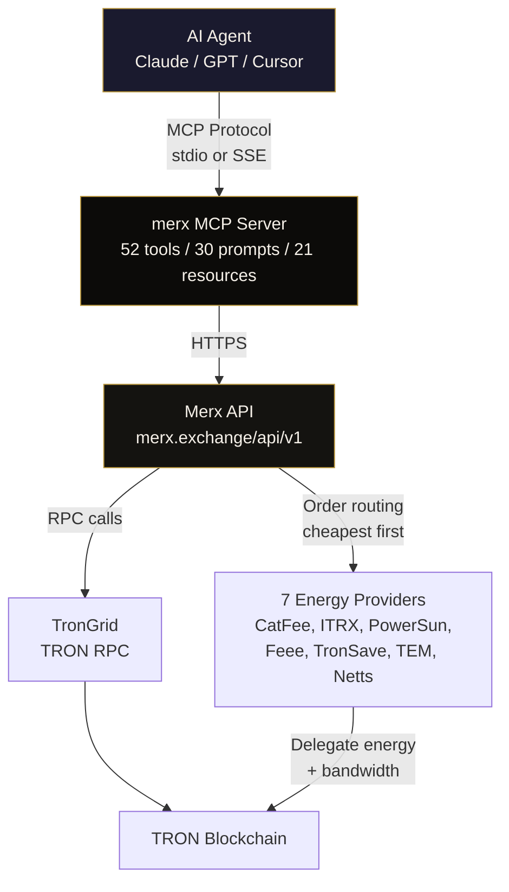
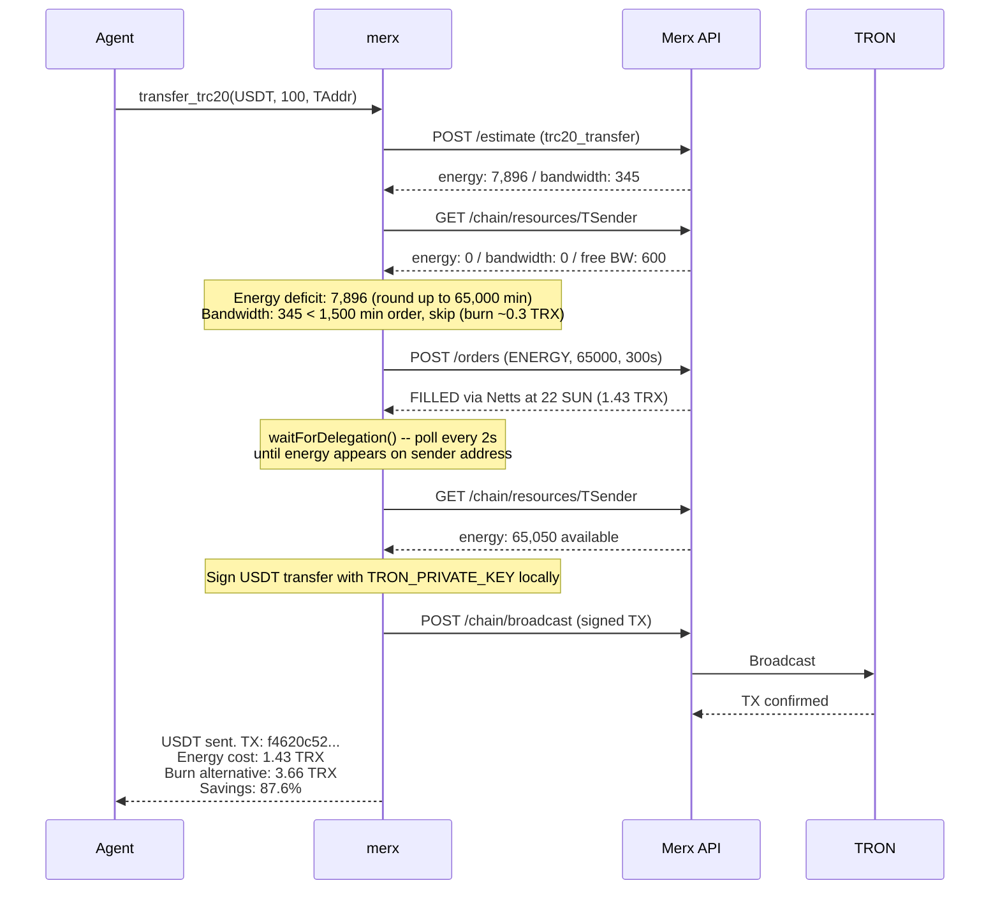

# merx

**The complete TRON infrastructure layer for AI agents.**

[](https://www.npmjs.com/package/merx)
[](LICENSE)


> Buy energy. Send USDT. Swap tokens. Simulate transactions. Monitor delegations.
> All with automatic resource optimization across 7 providers.
> One config line. Full TRON access.

```json
{ "mcpServers": { "merx": { "url": "https://merx.exchange/mcp/sse" } } }
```

**52 tools** | **30 prompts** | **21 resources** | **7 energy providers** | **2 transport modes** | **3 payment methods**

[Documentation](https://merx.exchange/docs) | [API Reference](https://merx.exchange/docs/api-reference) | [Examples](docs/EXAMPLES.md) | [Comparison](docs/COMPARISON.md)

---

## Table of contents

- [Why merx exists](#why-merx-exists)
- [Quick start](#quick-start)
- [What sets merx apart](#what-sets-merx-apart)
- [Architecture](#architecture)
- [All capabilities](#all-capabilities)
- [Examples](#examples)
- [Tool reference](#tool-reference)
- [Prompts](#prompts)
- [Resources](#resources)
- [Configuration](#configuration)
- [Tested on TRON mainnet](#tested-on-tron-mainnet)
- [Comparison with alternatives](#comparison-with-alternatives)
- [Documentation](#documentation)
- [License](#license)

---

## Why merx exists

Every smart contract call on TRON requires energy. Without energy, TRX tokens are
burned as fees. A single USDT transfer burns 3-13 TRX depending on whether the
receiving address has held USDT before (approximately $1-4 at current prices). With
rented energy, the same transfer costs 0.17-1.43 TRX ($0.05-0.46). That is up to a
94% reduction in transaction costs. High-volume wallets -- exchanges, payment
processors, trading bots -- burn thousands of TRX daily without resource optimization.

The TRON energy market is fragmented across 7+ providers: CatFee, ITRX, PowerSun,
Feee, TronSave, TEM, Netts. Each has different prices (22-80 SUN per unit), different
APIs, different durations (5 minutes to 30 days). Prices change every 30 seconds. No
single tool aggregates them all, compares prices in real time, and routes orders to
the cheapest source. (Note: 1 TRX = 1,000,000 SUN.)

AI agents operating on TRON face this problem at scale. Every USDT transfer, every
token swap, every contract call needs energy and bandwidth. Without an infrastructure
layer, each agent must integrate with multiple providers, manage resource estimation,
handle fallbacks, and track delegations individually. merx solves all of this with one
MCP server -- 52 tools that cover the entire TRON resource lifecycle, from price
discovery through transaction execution.

### Without merx

```
1. Check 7 provider websites for energy prices
2. Check bandwidth prices separately (different providers)
3. Compare prices across 15+ duration tiers
4. Create account on cheapest provider
5. Fund account on that provider
6. Call provider's unique API to order energy
7. Wait for delegation, hope it arrives
8. Build and sign your transaction
9. No bandwidth optimization -- burn TRX for bandwidth
10. If provider fails -- start over with the next one
```

### With merx

```
Agent: "Send 100 USDT to TAddr"

merx: estimates energy (7,896) + bandwidth (345)
    -> buys 65,000 energy at 22 SUN via Netts (cheapest)
    -> skips bandwidth (free daily covers it)
    -> waits for delegation to arrive on-chain
    -> signs USDT transfer locally
    -> broadcasts to TRON

Done. One tool call. 0.46 TRX instead of 3.66 TRX. 87% saved.
```

---

## Quick start

### Option 1: Hosted (zero install)

Works with Claude.ai, Cursor, and any MCP client that supports SSE transport.

```json
{
  "mcpServers": {
    "merx": {
      "url": "https://merx.exchange/mcp/sse"
    }
  }
}
```

No npm install, no API key. 22 read-only tools are available immediately: prices,
estimation, market analysis, on-chain queries, address lookups.

To unlock trading tools, call `set_api_key` in any conversation:

```
Agent: set_api_key("merx_sk_your_key")
-> All 34 authenticated tools unlocked for this session.
```

To unlock write tools (send TRX, swap tokens), call `set_private_key`:

```
Agent: set_private_key("your_64_char_hex_key")
-> Address derived automatically: THT49...
-> All 52 tools available. Key never leaves your machine.
```

### Option 2: Local (stdio)

Full power with keys set via environment variables. No need to call `set_api_key`
or `set_private_key` each session.

```bash
npm install -g merx
```

```json
{
  "mcpServers": {
    "merx": {
      "command": "npx merx",
      "env": {
        "MERX_API_KEY": "merx_sk_your_key",
        "TRON_PRIVATE_KEY": "your_private_key"
      }
    }
  }
}
```

All 52 tools available from first message.

### What you get at each level

| Configuration | Tools | Capabilities |
|---|---|---|
| No keys | 22 | Prices, estimation, market analysis, explanations, on-chain queries, address lookups |
| + `MERX_API_KEY` | 34 | + Buy energy/bandwidth, orders, balance, standing orders, monitors |
| + `TRON_PRIVATE_KEY` | 52 | + Send TRX/USDT, swap tokens, approve contracts, execute intents, self-deposit |

See [Configuration](docs/CONFIGURATION.md) for all environment variables and client configs.

---

## What sets merx apart

### Multi-provider routing

7 providers aggregated: Netts, CatFee, TEM, ITRX, TronSave, Feee, PowerSun. Orders
are routed to the cheapest source automatically. If one provider fails, the next
cheapest fills the order. Prices cover both energy and bandwidth.

### Resource-aware transactions

Every write operation (USDT transfer, token swap, contract call) automatically
estimates energy AND bandwidth needed, buys the deficit at best market price, waits
for delegation to arrive on-chain, then executes. The agent never burns TRX
unnecessarily. Tested on mainnet: a USDT transfer with auto-resources saves up to
94% compared to burning.

### Exact energy simulation

Before buying energy for swaps and contract calls, merx simulates the exact
transaction via `triggerConstantContract` with real parameters. No hardcoded
estimates -- the precise energy amount is purchased. For a SunSwap swap, simulation
returned 223,354 energy; the on-chain transaction used exactly 223,354.

### Intent execution

The agent describes a multi-step plan (transfer + swap + another transfer). merx
simulates all steps, estimates total resource cost, and executes sequentially.
Stateful simulation: energy consumed by step 1 is not available for step 2.

### Standing orders

Server-side 24/7 automation stored in PostgreSQL. Example: "Buy 65,000 energy when
price drops below 20 SUN." Trigger types: `price_below`, `price_above`, `schedule`
(cron), `balance_below`. Persists across restarts. Works when the agent is offline.

### Delegation monitors

Watch energy and bandwidth delegations on any address. Alert before expiry.
Auto-renew with configurable max price. Monitor types: `delegation_expiry`,
`balance_threshold`, `price_alert`.

### x402 pay-per-use

No account needed. No pre-deposit. The agent creates an invoice, pays with TRX from
its own wallet, and receives energy delegation. Complete flow in one tool call.
Tested on mainnet: 1.43 TRX payment resulted in 65,050 energy delegated.

### Full MCP protocol

The only TRON MCP server using all three MCP primitives: tools (52), prompts (30),
and resources (21 -- 14 static + 7 templates). No other blockchain MCP server has
this coverage.

---

## Architecture



<details>
<summary>ASCII diagram (if Mermaid does not render)</summary>

```
AI Agent (Claude / GPT / Cursor)
    |
    | MCP Protocol (stdio or SSE)
    v
merx MCP Server (52 tools)
    |
    | HTTPS
    v
Merx API (merx.exchange/api/v1)
    |
    +---> TronGrid (TRON RPC)
    |         |
    |         v
    |     TRON Blockchain
    |
    +---> 7 Energy Providers
              |
              v
          TRON Blockchain (delegate energy + bandwidth)
```

</details>

**Key architecture principle:** All traffic goes through Merx API. The user never
needs TronGrid API keys. Merx manages all RPC infrastructure, caching, and failover
server-side. The only operation that stays on the client: transaction signing with
`TRON_PRIVATE_KEY`. Private keys never leave the MCP process.

### Resource-aware transaction flow

This sequence diagram shows a real USDT transfer with auto-resource optimization.
Numbers are from production testing on 2026-03-30.



<details>
<summary>ASCII diagram (if Mermaid does not render)</summary>

```
Agent                   merx                    Merx API                TRON
  |                       |                       |                      |
  | transfer_trc20(...)   |                       |                      |
  |---------------------->|                       |                      |
  |                       | POST /estimate        |                      |
  |                       |---------------------->|                      |
  |                       |   energy: 7,896       |                      |
  |                       |   bandwidth: 345      |                      |
  |                       |<----------------------|                      |
  |                       |                       |                      |
  |                       | GET /chain/resources  |                      |
  |                       |---------------------->|                      |
  |                       |   energy: 0, BW: 0    |                      |
  |                       |<----------------------|                      |
  |                       |                       |                      |
  |                       | [Energy deficit: 7,896 -> round up to 65,000]|
  |                       | [Bandwidth: 345 < 1,500 min -> skip]        |
  |                       |                       |                      |
  |                       | POST /orders          |                      |
  |                       | (ENERGY, 65000, 300s) |                      |
  |                       |---------------------->|                      |
  |                       |   FILLED via Netts    |                      |
  |                       |   22 SUN = 1.43 TRX   |                      |
  |                       |<----------------------|                      |
  |                       |                       |                      |
  |                       | [Poll every 2s until delegation arrives]     |
  |                       |                       |                      |
  |                       | GET /chain/resources  |                      |
  |                       |---------------------->|                      |
  |                       |   energy: 65,050      |                      |
  |                       |<----------------------|                      |
  |                       |                       |                      |
  |                       | [Sign TX locally with TRON_PRIVATE_KEY]      |
  |                       |                       |                      |
  |                       | POST /chain/broadcast |                      |
  |                       |---------------------->|--------------------->|
  |                       |                       |   TX confirmed       |
  |                       |<----------------------|<---------------------|
  |                       |                       |                      |
  |   USDT sent           |                       |                      |
  |   Cost: 1.43 TRX      |                       |                      |
  |   Burn alt: 3.66 TRX  |                       |                      |
  |   Savings: 87.6%      |                       |                      |
  |<----------------------|                       |                      |
```

</details>

### Resource purchase rules

These rules are derived from production testing:

| Rule | Details |
|---|---|
| Energy deficit > 0 | Round up to minimum 65,000 units. Cheaper to buy minimum than to burn even small deficits. |
| Bandwidth deficit < 1,500 | Skip purchase, let network burn ~0.3 TRX. Cheaper than minimum bandwidth order. |
| After energy purchase | Poll `check_address_resources` every 2 seconds until delegation arrives on-chain. Never broadcast TX before delegation is confirmed. |
| DEX swaps | Simulate exact energy via `triggerConstantContract` with real swap parameters. Do not use hardcoded estimates. |

---

## All capabilities

| Category | Tools | Auth | Description |
|---|---|---|---|
| Price Intelligence | 5 | -- | Real-time prices from 7 providers, market analysis, trends, history |
| Resource Estimation | 2 | -- | Estimate energy + bandwidth for any transaction type, compare rent vs burn |
| Resource Trading | 4 | API key | Buy energy/bandwidth at best price, ensure resources on any address |
| Account Management | 3 | API key | Balance, deposit info, transaction history |
| Agent Convenience | 4 | -- | Explain concepts, suggest durations, calculate savings, list providers |
| On-chain Queries | 5 | -- | Account info, TRX/TRC20 balances, transaction lookup, blocks |
| Token Operations | 4 | Private key | Send TRX, transfer TRC20, approve tokens -- all resource-aware |
| Smart Contracts | 3 | Mixed | Read contract state, estimate call cost, execute with auto-resources |
| Network Utilities | 5 | -- | Chain parameters, address tools, TRX price, on-chain transaction history |
| DEX Swaps | 3 | Private key | SunSwap V2 quotes, execution with exact energy simulation |
| Onboarding | 2 | -- | Create account + login, no browser needed |
| Payments | 4 | Mixed | Self-deposit from wallet, auto-deposit config, x402 pay-per-use |
| Intent Execution | 2 | Mixed | Multi-step plans: simulate or execute complex operation sequences |
| Standing Orders | 4 | API key | Server-side 24/7 automation: price triggers, schedule, monitors |
| Session Management | 2 | -- | Set API key and private key for current session |
| **Total** | **52** | | |

See [complete tool reference](docs/TOOLS.md) for input schemas and examples.

---

## Examples

All examples below use real data from production testing on TRON mainnet (2026-03-30).
Prices, TX hashes, and savings percentages are from actual on-chain transactions.

### Example 1: Check energy prices

```
User: What's the cheapest energy right now?

Agent calls: get_prices(resource: "ENERGY")

merx returns:
  Provider | Type  | Best Price | Available     | Durations
  ---------|-------|------------|---------------|---------------------------
  netts    | Fixed | 22 SUN     | 100,000,000   | 5m, 1h
  catfee   | Fixed | 27 SUN     | 2,085,535,282 | 1h
  tem      | P2P   | 35 SUN     | 177,991,103   | 5m, 1h, 3h, 12h, 1d-30d
  itrx     | Fixed | 42 SUN     | 10,161,061    | 1h, 1d, 3d, 30d
  tronsave | P2P   | 50 SUN     | 40,136,084    | flexible
  powersun | Fixed | 80 SUN     | 29,780,366    | 2m-30d

Agent: The cheapest energy is 22 SUN/unit from Netts for 5-minute
delegation. For 65,000 energy (one USDT transfer), that's 1.43 TRX.
CatFee is next at 27 SUN (1-hour). Want me to buy some?
```

### Example 2: Buy energy and verify

```
User: Buy 65,000 energy for my address TLyqz...

Agent calls: set_api_key("merx_sk_...")
Agent calls: create_order(amount: 65000, duration_sec: 300,
  resource_type: "ENERGY", target_address: "TLyqz...")

merx returns:
  Order: ed7efe5f-a795-4dba-a2e6-8879967fc709
  Status: PENDING
  Created: 2026-03-30T06:44:44.839Z

Agent calls: get_order("ed7efe5f-a795-4dba-a2e6-8879967fc709")

merx returns:
  Order: ed7efe5f
  Status: FILLED
  Resource: ENERGY | Amount: 65000
  Duration: 5m | Cost: 1.4311 TRX
  Fills (1):
    netts: 65,050 @ 22 SUN = 1.4311 TRX [verified]
    TX: 27ab0019...

Agent: Done. 65,050 energy delegated to your address via Netts
at 22 SUN. Cost: 1.43 TRX. The delegation lasts 5 minutes.
TX hash: 27ab0019... (verified on-chain).
```

### Example 3: Market analysis

```
User: Is now a good time to buy energy?

Agent calls: analyze_prices(resource: "ENERGY")

merx returns:
  --- ENERGY ---
  Current best: netts at 22 SUN (5m)
  24h average:  58 SUN
  7d average:   62 SUN
  Percentile:   1%
  Trend:        falling
  Recommendation: good_time_to_buy
  Current best price (22 SUN) is 64% below the 7-day average.

Agent: Great time to buy. Energy is at 22 SUN -- the 1st percentile
of the last 7 days. That's 64% below the weekly average of 62 SUN.
The trend is falling. If you have upcoming transactions, buying now
locks in this rate.
```

### Example 4: Simulate a multi-step plan

```
User: I want to send 500 USDT to one address and 300 USDT to another.
How much will it cost?

Agent calls: simulate(steps: [
  { action: "transfer_trc20", params: { token: "USDT", to: "TAddr1", amount: "500" } },
  { action: "transfer_trc20", params: { token: "USDT", to: "TAddr2", amount: "300" } }
])

merx returns:
  Step 1: transfer_trc20 - 500 USDT -> TAddr1
    Energy: ~65,000 | Bandwidth: ~345
  Step 2: transfer_trc20 - 300 USDT -> TAddr2
    Energy: ~65,000 | Bandwidth: ~345

  Total energy: 130,000 | Total bandwidth: 690
  Rental cost: ~4.94 TRX
  Burn alternative: ~55.29 TRX
  Savings: 91%

Agent: Both transfers would need 130,000 energy total. Renting costs
about 4.94 TRX. Without energy, you'd burn 55.29 TRX. That's 91%
savings. Want me to execute both transfers?
```

### Example 5: SunSwap swap with auto-resources

```
User: Swap 0.1 TRX to USDT.

Agent calls: set_private_key("64_char_hex...")
Agent calls: execute_swap(from_token: "TRX", to_token: "USDT",
  amount: "0.1", slippage: 2)

merx returns:
  Swap Broadcast: 0.1 TRX -> USDT
  TX ID: 61424b1e89a047fe...
  Expected output: 0.032094 USDT
  Status: BROADCAST
  Energy purchased: 223,354

Agent calls: get_transaction("61424b1e89a047fe...")

merx returns:
  Status: SUCCESS
  Energy: 223,354
  Timestamp: 2026-03-30T09:49:51Z

Agent: Swap completed. 0.1 TRX swapped to 0.032094 USDT via SunSwap V2.
merx simulated the exact energy needed (223,354 units), bought it
at 22 SUN, waited for delegation, then executed the swap.
TX: 61424b1e... confirmed on-chain.
```

### Example 6: x402 zero-registration order

```
User: I need energy but I don't have a Merx account.
Just pay from my wallet.

Agent calls: set_private_key("64_char_hex...")
Agent calls: create_paid_order(amount: 65000, duration_sec: 300,
  resource_type: "ENERGY", target_address: "THT49...")

merx returns:
  x402 Order Created
  Invoice: inv_f41ffc2f...
  Payment TX: 53236a5a...
  Cost: 1.4300 TRX
  Order ID: cf22304f-5c10-408b...
  Status: PENDING
  Target: THT49FNBPAg1DYisqCtjmxHTQVLmgKYBg8
  Resource: 65000 ENERGY for 300s

Agent calls: check_address_resources("THT49...")

merx returns:
  Energy: 65,050 / 65,050 (used: 0)

Agent: Done. No account needed. merx created an invoice for 1.43 TRX,
paid it from your wallet (TX: 53236a5a...), and delegated 65,050
energy to your address. The whole process took one tool call.
```

---

## Tool reference

All 52 tools across 15 categories. For full input/output schemas, see [docs/TOOLS.md](docs/TOOLS.md).

### Price Intelligence

| # | Tool | Description | Auth |
|---|---|---|---|
| 1 | `get_prices` | Current energy and bandwidth prices from all providers | -- |
| 2 | `get_best_price` | Cheapest provider for given resource and amount | -- |
| 3 | `analyze_prices` | Market analysis with trends, percentile, and recommendation | -- |
| 4 | `get_price_history` | Historical price snapshots by provider, resource, and period | -- |
| 5 | `compare_providers` | Side-by-side provider comparison with all duration tiers | -- |

### Resource Estimation

| # | Tool | Description | Auth |
|---|---|---|---|
| 6 | `estimate_transaction_cost` | Estimate energy + bandwidth for TRX/TRC20/custom operations | -- |
| 7 | `check_address_resources` | Energy, bandwidth, free BW, and TRX balance for any address | -- |

### Resource Trading

| # | Tool | Description | Auth |
|---|---|---|---|
| 8 | `create_order` | Buy energy or bandwidth, routed to cheapest provider | API key |
| 9 | `get_order` | Order details with fills, TX hashes, and verification status | API key |
| 10 | `list_orders` | List orders with optional status filter | API key |
| 11 | `ensure_resources` | Declarative: ensure minimum energy/bandwidth on an address | API key |

### Account Management

| # | Tool | Description | Auth |
|---|---|---|---|
| 12 | `get_balance` | Merx account balance (TRX, USDT, locked) | API key |
| 13 | `get_deposit_info` | Merx deposit address and memo | API key |
| 14 | `get_transaction_history` | Merx account order history (7D/30D/90D) | API key |

### Agent Convenience

| # | Tool | Description | Auth |
|---|---|---|---|
| 15 | `explain_concept` | Explain TRON concepts: energy, bandwidth, staking, delegation, burn_vs_rent, merx_routing, provider_types, sun_units | -- |
| 16 | `suggest_duration` | Recommend rental duration based on use case and TX count | -- |
| 17 | `calculate_savings` | Calculate savings from renting vs burning for N transactions | -- |
| 18 | `list_providers` | All providers with types, durations, and availability | -- |

### On-chain Queries

| # | Tool | Description | Auth |
|---|---|---|---|
| 19 | `get_account_info` | Full on-chain account: TRX, energy, bandwidth, limits | -- |
| 20 | `get_trx_balance` | Quick TRX balance for any address | -- |
| 21 | `get_trc20_balance` | TRC-20 token balance (supports symbol or contract address) | -- |
| 22 | `get_transaction` | Look up transaction by ID with status, energy, bandwidth used | -- |
| 23 | `get_block` | Block info by number (or latest) | -- |

### Token Operations

| # | Tool | Description | Auth |
|---|---|---|---|
| 24 | `transfer_trx` | Send TRX with auto bandwidth optimization | Private key |
| 25 | `transfer_trc20` | Transfer TRC-20 tokens with auto energy + bandwidth | Private key |
| 26 | `approve_trc20` | Approve TRC-20 spending allowance with auto energy | Private key |
| 27 | `get_token_info` | Token metadata: name, symbol, decimals, total supply | -- |

### Smart Contracts

| # | Tool | Description | Auth |
|---|---|---|---|
| 28 | `read_contract` | Call view/pure contract functions (no gas, no signing) | -- |
| 29 | `estimate_contract_call` | Estimate energy + bandwidth for a contract call | -- |
| 30 | `call_contract` | Execute state-changing contract function with auto resources | Private key |

### Network Utilities

| # | Tool | Description | Auth |
|---|---|---|---|
| 31 | `get_chain_parameters` | TRON network parameters with Merx price comparison | -- |
| 32 | `convert_address` | Convert between base58 (T...) and hex (41...) formats | -- |
| 33 | `get_trx_price` | Current TRX price from CoinGecko | -- |
| 34 | `validate_address` | Validate TRON address format and check on-chain status | -- |
| 35 | `search_transaction_history` | On-chain transaction history for any address | -- |

### DEX Swaps

| # | Tool | Description | Auth |
|---|---|---|---|
| 36 | `get_swap_quote` | Real SunSwap V2 quote with expected output and slippage | -- |
| 37 | `execute_swap` | Execute SunSwap swap with exact energy simulation | Private key |
| 38 | `get_token_price` | Token price via SunSwap pools + CoinGecko USD rate | -- |

### Onboarding

| # | Tool | Description | Auth |
|---|---|---|---|
| 39 | `create_account` | Create Merx account and get API key | -- |
| 40 | `login` | Log in to existing Merx account | -- |

### Payments

| # | Tool | Description | Auth |
|---|---|---|---|
| 41 | `deposit_trx` | Deposit TRX to Merx from wallet (signs TX with memo) | API key + Private key |
| 42 | `enable_auto_deposit` | Configure auto-deposit when balance drops below threshold | API key |
| 43 | `pay_invoice` | Pay an existing x402 invoice | Private key |
| 44 | `create_paid_order` | x402 zero-registration order: invoice, pay, verify, order | Private key |

### Intent Execution

| # | Tool | Description | Auth |
|---|---|---|---|
| 45 | `execute_intent` | Execute multi-step plan with resource optimization | API key |
| 46 | `simulate` | Simulate multi-step plan without executing | -- |

### Standing Orders and Monitors

| # | Tool | Description | Auth |
|---|---|---|---|
| 47 | `create_standing_order` | Create server-side standing order with trigger + action | API key |
| 48 | `list_standing_orders` | List standing orders with status filter | API key |
| 49 | `create_monitor` | Create persistent monitor (delegation, balance, price) | API key |
| 50 | `list_monitors` | List monitors with status filter | API key |

### Session Management

| # | Tool | Description | Auth |
|---|---|---|---|
| 51 | `set_api_key` | Set Merx API key for this session | -- |
| 52 | `set_private_key` | Set TRON private key for this session (address auto-derived) | -- |

---

## Prompts

30 pre-built conversation templates. Available in Claude Desktop prompt picker and
via `prompts/get` in any MCP client.

### Market

| # | Prompt | Description |
|---|---|---|
| 1 | `buy-energy` | Buy energy at best market price |
| 2 | `buy-bandwidth` | Buy bandwidth at best market price |
| 3 | `ensure-resources` | Ensure minimum resources on an address |
| 4 | `market-analysis` | Full market analysis with trends |
| 5 | `compare-providers` | Side-by-side provider comparison |

### Transactions

| # | Prompt | Description |
|---|---|---|
| 6 | `send-usdt` | Send USDT with auto resource optimization |
| 7 | `send-trx` | Send TRX with bandwidth handling |
| 8 | `send-token` | Send any TRC-20 token |
| 9 | `multi-transfer` | Batch transfers to multiple addresses |
| 10 | `explain-transaction` | Explain a transaction by TX hash |

### Wallet

| # | Prompt | Description |
|---|---|---|
| 11 | `check-wallet` | Full wallet overview (balances, resources, delegations) |
| 12 | `audit-spending` | Analyze energy and bandwidth spending |
| 13 | `monitor-delegations` | Check and monitor active delegations |
| 14 | `optimize-wallet` | Suggest optimizations for a wallet |

### DEX

| # | Prompt | Description |
|---|---|---|
| 15 | `swap-tokens` | Swap tokens via SunSwap |
| 16 | `check-token` | Token info and price |
| 17 | `price-check` | Quick price check for any token |

### Planning

| # | Prompt | Description |
|---|---|---|
| 18 | `estimate-costs` | Estimate costs for operations |
| 19 | `budget-plan` | Plan energy budget for a period |
| 20 | `stake-vs-rent` | Compare staking vs renting economics |

### Developer

| # | Prompt | Description |
|---|---|---|
| 21 | `integrate-merx` | How to integrate Merx API |
| 22 | `setup-mcp` | How to set up the MCP server |

### Onboarding

| # | Prompt | Description |
|---|---|---|
| 23 | `onboard` | Create account and get started |
| 24 | `fund-account` | Fund Merx account from wallet |

### Payments

| # | Prompt | Description |
|---|---|---|
| 25 | `setup-auto-funding` | Configure auto-deposit |
| 26 | `buy-without-account` | x402 zero-registration purchase |

### Simulation

| # | Prompt | Description |
|---|---|---|
| 27 | `simulate-plan` | Simulate a multi-step plan |
| 28 | `execute-plan` | Execute a simulated plan |

### Monitoring

| # | Prompt | Description |
|---|---|---|
| 29 | `setup-standing-order` | Create a standing order |
| 30 | `auto-renew-delegations` | Set up auto-renewal for delegations |

See [docs/PROMPTS.md](docs/PROMPTS.md) for full prompt templates.

---

## Resources

21 live data endpoints. Attach to conversations as context or subscribe for
real-time updates.

### Static Resources (14)

| # | URI | Description | Updates |
|---|---|---|---|
| 1 | `merx://prices/energy` | Energy prices from all providers | Every 30s |
| 2 | `merx://prices/bandwidth` | Bandwidth prices from all providers | Every 30s |
| 3 | `merx://prices/best` | Current best price for energy and bandwidth | Every 30s |
| 4 | `merx://market/analysis` | Market analysis with trends and recommendations | Every 5m |
| 5 | `merx://market/providers` | All providers with types, durations, availability | Every 30s |
| 6 | `merx://market/providers/status` | Provider online/offline status | Every 30s |
| 7 | `merx://account/balance` | Merx account balance | On change |
| 8 | `merx://account/orders/recent` | Recent orders | On change |
| 9 | `merx://account/stats` | Account statistics | Every 5m |
| 10 | `merx://account/auto-deposit` | Auto-deposit configuration | On change |
| 11 | `merx://network/parameters` | TRON network parameters | Every 1h |
| 12 | `merx://network/trx-price` | Current TRX/USD price | Every 1m |
| 13 | `merx://reference/tokens` | Known token addresses and metadata | Static |
| 14 | `merx://standing-orders/active` | Active standing orders | On change |

### Resource Templates (7)

| # | URI Template | Description |
|---|---|---|
| 1 | `merx://address/{address}/overview` | Full address state: TRX, tokens, energy, bandwidth |
| 2 | `merx://address/{address}/resources` | Energy + bandwidth with free BW tracking |
| 3 | `merx://address/{address}/transactions` | Recent transactions with type and amounts |
| 4 | `merx://address/{address}/delegations` | Active delegations with expiry times |
| 5 | `merx://token/{token}/info` | Token metadata + price + transfer energy cost |
| 6 | `merx://order/{order_id}/status` | Order details with fills and cost breakdown |
| 7 | `merx://standing-order/{id}/status` | Standing order trigger state and executions |

See [docs/RESOURCES.md](docs/RESOURCES.md) for content schemas and subscription details.

---

## Configuration

### Claude.ai (web) -- hosted SSE

```json
{
  "mcpServers": {
    "merx": {
      "url": "https://merx.exchange/mcp/sse"
    }
  }
}
```

Then use `set_api_key` and `set_private_key` tools in conversation to authenticate.

### Cursor -- hosted SSE

Add to `.cursor/mcp.json`:

```json
{
  "mcpServers": {
    "merx": {
      "url": "https://merx.exchange/mcp/sse"
    }
  }
}
```

### Claude Code -- stdio

```bash
claude mcp add merx -- npx merx
```

Or add to `.claude/settings.json`:

```json
{
  "mcpServers": {
    "merx": {
      "command": "npx merx",
      "env": {
        "MERX_API_KEY": "merx_sk_your_key",
        "TRON_PRIVATE_KEY": "your_private_key"
      }
    }
  }
}
```

### Any MCP client -- local stdio

```bash
npm install -g merx
```

```json
{
  "mcpServers": {
    "merx": {
      "command": "npx merx",
      "env": {
        "MERX_API_KEY": "merx_sk_your_key",
        "TRON_PRIVATE_KEY": "your_private_key"
      }
    }
  }
}
```

### Environment variables

| Variable | Required | Description |
|---|---|---|
| `MERX_API_KEY` | For trading | API key from merx.exchange. Or use `create_account` tool to get one in-session. Or use `set_api_key` tool. |
| `TRON_PRIVATE_KEY` | For signing | Your TRON wallet private key. Never sent to any server. Used only for local TX signing. Or use `set_private_key` tool. |
| `MERX_BASE_URL` | No | Override API URL. Default: `https://merx.exchange` |

Note: No `TRONGRID_API_KEY` needed. merx manages all RPC infrastructure server-side.

### Graceful degradation

merx works with zero configuration. As you add keys, more tools become available.

| Level | Keys | Available tools | Example capabilities |
|---|---|---|---|
| Read-only | None | 22 | `get_prices`, `analyze_prices`, `estimate_transaction_cost`, `get_account_info`, `get_swap_quote`, `explain_concept` |
| Trading | `MERX_API_KEY` | 34 | + `create_order`, `ensure_resources`, `get_balance`, `create_standing_order`, `create_monitor` |
| Full access | `MERX_API_KEY` + `TRON_PRIVATE_KEY` | 52 | + `transfer_trx`, `transfer_trc20`, `execute_swap`, `call_contract`, `execute_intent`, `deposit_trx` |

See [docs/CONFIGURATION.md](docs/CONFIGURATION.md) for detailed setup guides and troubleshooting.

---

## Tested on TRON mainnet

Every tool was tested in production on TRON mainnet. These are not simulations --
every TX hash is verifiable on [TronScan](https://tronscan.org).

Testing date: 2026-03-30.

| Category | Tool | TX Hash | Status | Details |
|---|---|---|---|---|
| Token Operations | `transfer_trx` | `b22813a813c3...990e7955` | SUCCESS | 0.1 TRX sent, 267 bandwidth consumed |
| Payments | `deposit_trx` | `4bc60854f828...8ddcd509` | SUCCESS | 10 TRX deposited to Merx with memo, credited to balance |
| Token Operations | `approve_trc20` | `56fc87f319b9...0bf5ffbb` | SUCCESS | USDT approval, 99,764 energy consumed |
| Smart Contracts | `call_contract` | `fc55aee3dc50...4bb5c1bf` | SUCCESS | name() call on contract, 4,098 energy consumed |
| DEX Swaps | `execute_swap` | `61424b1e89a0...d066d21577` | SUCCESS | 0.1 TRX -> 0.032 USDT via SunSwap V2, 223,354 energy (exactly as simulated) |
| Resource Trading | `create_order` | `8adac3b8a859...4e69e4ca` | FILLED | 65,050 energy via Netts at 22 SUN, 1.43 TRX |
| Payments | `create_paid_order` | `53236a5aeba0...984dec7b` | SUCCESS | x402 flow: 1.43 TRX invoice paid, 65,050 energy delegated |

### Key findings from mainnet testing

| Metric | Value |
|---|---|
| Cheapest energy provider | Netts at 22 SUN/unit |
| USDT transfer energy (typical) | 65,000 units |
| USDT transfer cost (rented energy) | 1.43 TRX |
| USDT transfer cost (burned) | 3-13 TRX |
| Maximum savings observed | 94% |
| SunSwap swap energy (0.1 TRX -> USDT) | 223,354 units (exact simulation match) |
| SunSwap swap output | 0.032094 USDT for 0.1 TRX |
| x402 payment flow | Invoice -> pay -> verify -> order -> fill -> delegate (one tool call) |
| Energy delegation confirmation | 2-6 seconds after order fill |

---

## Comparison with alternatives

Factual comparison based on publicly available information. Last updated 2026-03-30.

| Feature | merx | Sun Protocol | Netts MCP | TronLink MCP | PowerSun MCP |
|---|---|---|---|---|---|
| Tools | 52 | ~20 | ~10 | 27 | 27 |
| Prompts | 30 | 0 | 0 | 0 | 0 |
| Resources | 21 | 0 | 0 | 0 | 0 |
| Transport | stdio + SSE | stdio | stdio | stdio | SSE |
| Energy providers | 7 | 0 | 1 | 0 | 1 |
| Bandwidth support | Yes | No | No | No | No |
| Auto resource purchase | Energy + BW | No | No | No | Energy only |
| Exact energy simulation | Yes | No | No | No | No |
| Intent execution | Yes | No | No | No | No |
| Transaction simulation | Yes | No | No | No | No |
| Standing orders (24/7) | Yes | No | No | No | No |
| Delegation monitors | Yes | No | No | No | No |
| Self-service onboarding | Yes | No | No | No | Yes |
| x402 pay-per-use | Yes | No | No | No | No |
| DEX swaps | Yes | No | No | No | Yes |
| Zero install option | Yes (SSE) | No | No | No | Yes (SSE) |
| Private key required | Optional | Yes | Yes | Yes | No |
| Tested on mainnet | 7 TX verified | Unknown | Unknown | Unknown | Unknown |

merx focuses on resource economics and transaction optimization. Other servers focus
on general blockchain operations. merx covers both.

---

## How it works

### Energy and bandwidth on TRON

Every operation on TRON consumes two resources:

| Resource | Purpose | Free daily | What happens without it |
|---|---|---|---|
| Energy | Smart contract execution (USDT transfers, swaps, approvals) | 0 (must stake or rent) | TRX burned at network rate |
| Bandwidth | Transaction serialization (every TX needs some) | 600 bytes/day | TRX burned at network rate |

Energy is the expensive one. A USDT transfer needs approximately 65,000 energy units.
Without rented energy, the network burns 3-13 TRX from the sender. With energy rented
at current market rates (22 SUN/unit from Netts), the same transfer costs 1.43 TRX.

### How merx routes orders


<details>
<summary>ASCII diagram (if Mermaid does not render)</summary>

```
Order: 65,000 ENERGY
    |
    | Route to cheapest
    v
Netts (22 SUN)
    |
    | Fallback if unavailable
    v
CatFee (27 SUN)
    |
    v
TEM (35 SUN)
    |
    v
ITRX (42 SUN)
    |
    v
TronSave (50 SUN)
    |
    v
PowerSun (80 SUN)
```

</details>

### Price comparison (2026-03-30)

| Provider | Type | Price (SUN) | Price (TRX per 65K) | Available | Durations |
|---|---|---|---|---|---|
| Netts | Fixed | 22 | 1.43 | 100,000,000 | 5m, 1h |
| CatFee | Fixed | 27 | 1.76 | 2,085,535,282 | 1h |
| TEM | P2P | 35 | 2.28 | 177,991,103 | 5m, 1h, 3h, 12h, 1d-30d |
| ITRX | Fixed | 42 | 2.73 | 10,161,061 | 1h, 1d, 3d, 30d |
| TronSave | P2P | 50 | 3.25 | 40,136,084 | flexible |
| PowerSun | Fixed | 80 | 5.20 | 29,780,366 | 2m-30d |

Prices are per energy unit. 1 TRX = 1,000,000 SUN. The "Price (TRX per 65K)" column
shows the cost for one USDT transfer worth of energy (65,000 units).

### Savings calculator

| Scenario | Burn cost | Rental cost (Netts) | Savings |
|---|---|---|---|
| 1 USDT transfer | 3-13 TRX | 1.43 TRX | 56-89% |
| 10 USDT transfers | 30-130 TRX | 14.30 TRX | 52-89% |
| 100 USDT transfers/day | 300-1,300 TRX | 143 TRX | 52-89% |
| SunSwap swap (small) | ~50 TRX | ~4.91 TRX | ~90% |
| Contract call (simple) | ~1 TRX | ~0.09 TRX | ~91% |

Numbers assume Netts at 22 SUN. Actual burn cost varies by recipient address state
(whether it has held the token before).

---

## Payment methods

merx supports three ways to pay for energy and bandwidth:

### 1. Pre-funded Merx balance

Deposit TRX to your Merx account via the dashboard at merx.exchange. Trade directly
from your balance. Best for high-volume users.

```
Agent: get_balance()
-> Available: 45.20 TRX | Locked: 1.43 TRX | Total: 46.63 TRX
```

### 2. Self-deposit from agent wallet

The agent deposits TRX to Merx from its own wallet using the `deposit_trx` tool.
The tool builds a TRX transfer with the correct memo, signs it locally, and
broadcasts. Balance is credited in 1-2 minutes.

```
Agent: deposit_trx(amount: 10)
-> TX: 4bc60854f828...8ddcd509
-> 10 TRX deposited. Will be credited to your Merx balance shortly.
```

### 3. x402 pay-per-use

No account needed. No pre-deposit. The agent creates an invoice, pays with TRX from
its own wallet, and receives energy delegation directly. Complete flow in one tool
call via `create_paid_order`.

```
Agent: create_paid_order(amount: 65000, duration_sec: 300,
  resource_type: "ENERGY", target_address: "THT49...")
-> Invoice: inv_f41ffc2f...
-> Payment TX: 53236a5a...
-> Cost: 1.43 TRX
-> Status: PENDING -> FILLED
-> 65,050 energy delegated to THT49...
```

| Method | Setup required | Best for | Min deposit |
|---|---|---|---|
| Pre-funded balance | Account + dashboard deposit | High-volume users, teams | Any amount |
| Self-deposit (`deposit_trx`) | API key + private key | Autonomous agents | Any amount |
| x402 (`create_paid_order`) | Private key only | One-off purchases, no-account agents | Per-order |

See [docs/PAYMENT-METHODS.md](docs/PAYMENT-METHODS.md) for detailed flow diagrams.

---

## Standing orders

Server-side 24/7 automation that runs even when the agent is offline. Stored in
PostgreSQL, survives restarts.

### Trigger types

| Trigger | Description | Example |
|---|---|---|
| `price_below` | Fire when best price drops below threshold | Buy 65,000 energy when price < 20 SUN |
| `price_above` | Fire when best price exceeds threshold | Alert when energy exceeds 50 SUN |
| `schedule` | Cron-based schedule | Buy energy every day at 03:00 UTC |
| `balance_below` | Fire when Merx balance drops below threshold | Auto-deposit 50 TRX when balance < 10 TRX |

### Action types

| Action | Description |
|---|---|
| `buy_resource` | Buy specified amount of energy or bandwidth |
| `ensure_resources` | Ensure minimum resources on target address |
| `notify_only` | Send notification via webhook or Telegram |

### Example: Buy cheap energy automatically

```
Agent: create_standing_order(
  trigger: { type: "price_below", resource: "ENERGY", threshold_sun: 20 },
  action: { type: "buy_resource", amount: 65000, duration_sec: 300 },
  target_address: "TLyqz...",
  max_executions: 10,
  budget_trx: 15
)

merx returns:
  Standing Order: so_a1b2c3d4
  Status: ACTIVE
  Trigger: ENERGY price < 20 SUN
  Action: Buy 65,000 energy (5m)
  Budget: 15 TRX (10 executions max)
  Target: TLyqz...
```

---

## Delegation monitors

Watch delegations and resources on any address. Alert before expiry.
Auto-renew with configurable max price.

### Monitor types

| Type | Description | Example |
|---|---|---|
| `delegation_expiry` | Alert before energy/bandwidth delegation expires | Alert 5 minutes before expiry, auto-renew at max 30 SUN |
| `balance_threshold` | Alert when TRX balance drops below threshold | Alert when balance < 5 TRX |
| `price_alert` | Alert on price movements | Alert when energy price drops below 20 SUN |

### Example: Auto-renew energy delegation

```
Agent: create_monitor(
  type: "delegation_expiry",
  address: "TLyqz...",
  resource: "ENERGY",
  alert_before_sec: 300,
  auto_renew: true,
  max_price_sun: 30
)

merx returns:
  Monitor: mon_e5f6g7h8
  Status: ACTIVE
  Type: delegation_expiry
  Address: TLyqz...
  Alert: 5 minutes before expiry
  Auto-renew: Yes (max 30 SUN)
```

---

## Intent execution

Execute multi-step plans with resource optimization. merx handles the entire
lifecycle: simulate resources for all steps, purchase in batch, execute sequentially.

### Supported step actions

| Action | Description | Required params |
|---|---|---|
| `transfer_trx` | Send TRX | `to`, `amount` |
| `transfer_trc20` | Send TRC-20 token | `token`, `to`, `amount` |
| `approve_trc20` | Approve token spending | `token`, `spender`, `amount` |
| `execute_swap` | SunSwap token swap | `from_token`, `to_token`, `amount` |
| `call_contract` | Execute contract function | `contract`, `function`, `params` |

### Resource strategies

| Strategy | Description | Best for |
|---|---|---|
| `batch_cheapest` | Buy all energy at once before executing any step | Multiple same-type operations |
| `per_step` | Buy energy before each individual step | Mixed operations with different energy needs |
| `no_resources` | Skip resource purchase (assume resources available) | Pre-funded addresses |

### Stateful simulation

When simulating multi-step plans, merx tracks resource consumption across steps.
Energy consumed by step 1 is not available for step 2. This ensures accurate total
cost estimates.

```
Agent: simulate(steps: [
  { action: "transfer_trc20", params: { token: "USDT", to: "TAddr1", amount: "500" } },
  { action: "transfer_trc20", params: { token: "USDT", to: "TAddr2", amount: "300" } },
  { action: "execute_swap", params: { from_token: "TRX", to_token: "USDT", amount: "10" } }
])

merx returns:
  Step 1: transfer_trc20 - 500 USDT -> TAddr1
    Energy: ~65,000 | Bandwidth: ~345
  Step 2: transfer_trc20 - 300 USDT -> TAddr2
    Energy: ~65,000 | Bandwidth: ~345
  Step 3: execute_swap - 10 TRX -> USDT
    Energy: ~223,354 | Bandwidth: ~400

  Total energy: 353,354 | Total bandwidth: 1,090
  Rental cost: ~7.77 TRX
  Burn alternative: ~105.50 TRX
  Savings: 93%
```

---

## SDK integration

### JavaScript / TypeScript

```typescript
import { MerxClient } from "merx";

const merx = new MerxClient({
  apiKey: "merx_sk_your_key",
});

// Get best energy price
const prices = await merx.prices.getAll({ resource: "ENERGY" });
console.log(prices[0]); // { provider: "netts", price_sun: 22, available: 100000000 }

// Buy energy
const order = await merx.orders.create({
  resource_type: "ENERGY",
  amount: 65000,
  duration_sec: 300,
  target_address: "TLyqz...",
});
console.log(order.status); // "FILLED"
console.log(order.cost_trx); // 1.4311
```

### Python

```python
from merx import MerxClient

merx = MerxClient(api_key="merx_sk_your_key")

# Get best energy price
prices = merx.prices.get_all(resource="ENERGY")
print(prices[0])  # {"provider": "netts", "price_sun": 22, "available": 100000000}

# Buy energy
order = merx.orders.create(
    resource_type="ENERGY",
    amount=65000,
    duration_sec=300,
    target_address="TLyqz..."
)
print(order.status)   # "FILLED"
print(order.cost_trx) # 1.4311
```

### REST API

```bash
# Get energy prices
curl https://merx.exchange/api/v1/prices?resource=ENERGY

# Create order
curl -X POST https://merx.exchange/api/v1/orders \
  -H "Authorization: Bearer merx_sk_your_key" \
  -H "Content-Type: application/json" \
  -d '{
    "resource_type": "ENERGY",
    "amount": 65000,
    "duration_sec": 300,
    "target_address": "TLyqz..."
  }'
```

See [API Reference](https://merx.exchange/docs/api-reference) for all endpoints.

---

## Security

### Private key handling

- Private keys are set via environment variable (`TRON_PRIVATE_KEY`) or the
  `set_private_key` tool in-session
- Keys never leave the MCP process. All transaction signing happens locally
- The Merx API never receives private keys
- The `set_private_key` tool derives the TRON address automatically via TronWeb --
  the user only provides the 64-character hex key

### API key handling

- API keys authenticate with the Merx API for trading operations
- Keys can be set via environment variable (`MERX_API_KEY`) or the `set_api_key`
  tool in-session
- Create an account and get an API key without leaving the conversation using the
  `create_account` tool

### What merx can and cannot do

| With private key | Without private key |
|---|---|
| Sign and broadcast transactions | Read-only operations only |
| Send TRX and TRC-20 tokens | Check prices and balances |
| Execute swaps | Get swap quotes |
| Approve contracts | Estimate costs |
| Deposit TRX to Merx | View market data |

---

## Error handling

All errors follow a standard format:

```json
{
  "error": {
    "code": "INSUFFICIENT_BALANCE",
    "message": "Merx balance too low. Need 1.43 TRX, have 0.50 TRX.",
    "details": {
      "required_trx": 1.43,
      "available_trx": 0.50
    }
  }
}
```

### Common error codes

| Code | Description | Resolution |
|---|---|---|
| `INSUFFICIENT_BALANCE` | Merx account balance too low | Deposit TRX via dashboard or `deposit_trx` tool |
| `PROVIDER_UNAVAILABLE` | All providers failed for this order | Try again later or increase max price |
| `INVALID_ADDRESS` | TRON address format invalid | Check address starts with T and is 34 characters |
| `DELEGATION_TIMEOUT` | Energy delegation did not arrive within timeout | Check order status with `get_order` |
| `SIMULATION_FAILED` | Contract call simulation failed | Check contract address and function parameters |
| `PRIVATE_KEY_REQUIRED` | Operation requires TRON private key | Call `set_private_key` or set `TRON_PRIVATE_KEY` env var |
| `API_KEY_REQUIRED` | Operation requires Merx API key | Call `set_api_key` or set `MERX_API_KEY` env var |
| `ORDER_MIN_AMOUNT` | Amount below minimum order size | Energy minimum: 65,000. Bandwidth minimum: 1,500 |

---

## Frequently asked questions

### Is merx free to use?

Read-only tools (22 tools) are free with no account. You pay only for energy and
bandwidth purchases -- the cost goes to the provider (Netts, CatFee, etc.). Merx
adds a small routing fee.

### Do I need a TronGrid API key?

No. merx manages all RPC infrastructure server-side. You never need to configure
TronGrid, Tatum, or any other TRON RPC provider.

### Is my private key safe?

Your private key never leaves the MCP process running on your machine. All transaction
signing happens locally. The Merx API receives only signed transaction bytes, never
the key itself. When using SSE transport, the key stays in the browser/client -- it
is sent to the MCP server process but never forwarded to the API.

### What is the minimum order size?

Energy: 65,000 units (approximately 1.43 TRX at current rates).
Bandwidth: 1,500 units.

### How fast is energy delegation?

After an order is filled, energy appears on the target address within 2-6 seconds.
merx polls `check_address_resources` every 2 seconds and only proceeds with the
transaction once delegation is confirmed on-chain.

### What happens if a provider is down?

merx automatically falls back to the next cheapest provider. If Netts is unavailable,
the order routes to CatFee (27 SUN). If CatFee is also down, it tries TEM (35 SUN),
and so on through all 7 providers.

### Can I use merx for mainnet and testnet?

merx is configured for TRON mainnet by default. For Shasta testnet, set
`MERX_BASE_URL` to a testnet-compatible endpoint. Note: most energy providers only
operate on mainnet.

### What is x402?

x402 is a pay-per-use payment flow. The agent creates an invoice for the energy
cost, pays with TRX from its own wallet, and receives the delegation -- all without
creating a Merx account or pre-depositing funds. It is named after the HTTP 402
Payment Required status code.

### How are SUN and TRX related?

1 TRX = 1,000,000 SUN. Energy prices are quoted in SUN per unit. To convert: if
energy costs 22 SUN per unit and you need 65,000 units, the total is
22 * 65,000 = 1,430,000 SUN = 1.43 TRX.

---

## Glossary

| Term | Definition |
|---|---|
| Energy | Resource consumed by smart contract execution on TRON. Without it, TRX is burned as fee. |
| Bandwidth | Resource consumed by transaction serialization. Every TX needs some. 600 bytes/day free. |
| SUN | Smallest unit of TRX. 1 TRX = 1,000,000 SUN. Energy prices are quoted in SUN. |
| Delegation | Temporary assignment of energy or bandwidth from one address to another. |
| Burn | When TRX is permanently destroyed to pay for resources the sender does not have. |
| Provider | A service that delegates energy or bandwidth for a fee (Netts, CatFee, TEM, etc.). |
| Standing order | A server-side rule that triggers energy purchases based on price, schedule, or balance. |
| Monitor | A persistent watcher for delegation expiry, balance changes, or price movements. |
| x402 | Pay-per-use flow: invoice -> pay -> verify -> order. No account needed. |
| Intent | A multi-step execution plan (transfer + swap + transfer) with batched resource optimization. |
| TRC-20 | Token standard on TRON (equivalent to ERC-20 on Ethereum). USDT is the most common TRC-20 token. |

---

## API endpoints

The MCP server communicates with these Merx API endpoints. Most users interact
through MCP tools, not the API directly.

### Core endpoints

| Method | Endpoint | Description |
|---|---|---|
| GET | `/api/v1/prices` | Energy and bandwidth prices from all providers |
| GET | `/api/v1/prices/best` | Best price for given resource and amount |
| GET | `/api/v1/prices/analysis` | Market analysis with trends |
| GET | `/api/v1/prices/history` | Historical price data |
| POST | `/api/v1/orders` | Create energy/bandwidth order |
| GET | `/api/v1/orders/:id` | Order details |
| GET | `/api/v1/orders` | List orders |
| GET | `/api/v1/balance` | Account balance |
| GET | `/api/v1/deposit-info` | Deposit address and memo |
| GET | `/api/v1/transactions` | Transaction history |
| POST | `/api/v1/estimate` | Estimate transaction resources |
| GET | `/api/v1/providers` | Provider list with status |

### Chain proxy endpoints

| Method | Endpoint | Description |
|---|---|---|
| GET | `/api/v1/chain/account/:address` | On-chain account info |
| GET | `/api/v1/chain/resources/:address` | Energy and bandwidth for address |
| GET | `/api/v1/chain/transaction/:txid` | Transaction details |
| GET | `/api/v1/chain/block/:number` | Block info |
| POST | `/api/v1/chain/broadcast` | Broadcast signed transaction |
| GET | `/api/v1/chain/parameters` | Network parameters |
| POST | `/api/v1/chain/trigger-constant` | Simulate contract call |

### x402 endpoints

| Method | Endpoint | Description |
|---|---|---|
| POST | `/api/v1/x402/invoice` | Create payment invoice |
| POST | `/api/v1/x402/verify` | Verify payment TX |

### Standing orders and monitors

| Method | Endpoint | Description |
|---|---|---|
| POST | `/api/v1/standing-orders` | Create standing order |
| GET | `/api/v1/standing-orders` | List standing orders |
| DELETE | `/api/v1/standing-orders/:id` | Cancel standing order |
| POST | `/api/v1/monitors` | Create monitor |
| GET | `/api/v1/monitors` | List monitors |
| DELETE | `/api/v1/monitors/:id` | Cancel monitor |

See [API Reference](https://merx.exchange/docs/api-reference) for request/response schemas.

---

## Idempotency

All mutating operations support idempotency via the `Idempotency-Key` header:

```bash
curl -X POST https://merx.exchange/api/v1/orders \
  -H "Authorization: Bearer merx_sk_your_key" \
  -H "Idempotency-Key: unique-request-id-123" \
  -H "Content-Type: application/json" \
  -d '{"resource_type": "ENERGY", "amount": 65000, "duration_sec": 300}'
```

If the same `Idempotency-Key` is sent again, the API returns the original response
without creating a duplicate order. Keys expire after 24 hours.

Supported on: `POST /orders`, `POST /withdraw`, `POST /x402/invoice`.

---

## Rate limits

| Endpoint group | Limit | Window |
|---|---|---|
| Price queries (`/prices/*`) | 60 requests | Per minute |
| Order operations (`/orders/*`) | 30 requests | Per minute |
| Chain queries (`/chain/*`) | 120 requests | Per minute |
| Account operations (`/balance`, `/deposit-info`) | 30 requests | Per minute |

Rate limit headers are included in every response:

```
X-RateLimit-Limit: 60
X-RateLimit-Remaining: 58
X-RateLimit-Reset: 1743321600
```

---

## Changelog

### v1.0.0 (2026-03-30)

Initial release.

- 52 tools covering the full TRON resource lifecycle
- 30 prompts for common workflows
- 21 resources (14 static + 7 templates) for live data
- 7 energy providers: Netts, CatFee, TEM, ITRX, TronSave, Feee, PowerSun
- Resource-aware transactions: auto energy + bandwidth for all write operations
- Exact energy simulation for DEX swaps via `triggerConstantContract`
- Intent execution engine with stateful simulation
- Standing orders with 4 trigger types (price_below, price_above, schedule, balance_below)
- Delegation monitors with auto-renewal
- x402 pay-per-use flow (no account required)
- Self-deposit from agent wallet
- Auto-deposit configuration
- Dual transport: stdio + SSE
- Tested on TRON mainnet with 7 verified transactions

---

## Documentation

| | |
|---|---|
| Full docs | [merx.exchange/docs](https://merx.exchange/docs) |
| API reference | [merx.exchange/docs/api](https://merx.exchange/docs/api-reference) |
| Tool reference | [docs/TOOLS.md](docs/TOOLS.md) |
| Prompt catalog | [docs/PROMPTS.md](docs/PROMPTS.md) |
| Resource catalog | [docs/RESOURCES.md](docs/RESOURCES.md) |
| Architecture | [docs/ARCHITECTURE.md](docs/ARCHITECTURE.md) |
| Examples | [docs/EXAMPLES.md](docs/EXAMPLES.md) |
| Configuration | [docs/CONFIGURATION.md](docs/CONFIGURATION.md) |
| Comparison | [docs/COMPARISON.md](docs/COMPARISON.md) |
| Payment methods | [docs/PAYMENT-METHODS.md](docs/PAYMENT-METHODS.md) |
| Intent guide | [docs/INTENT-GUIDE.md](docs/INTENT-GUIDE.md) |
| Standing orders guide | [docs/STANDING-ORDERS-GUIDE.md](docs/STANDING-ORDERS-GUIDE.md) |
| Contributing | [docs/CONTRIBUTING.md](docs/CONTRIBUTING.md) |

---

## License

MIT. See [LICENSE](LICENSE).
