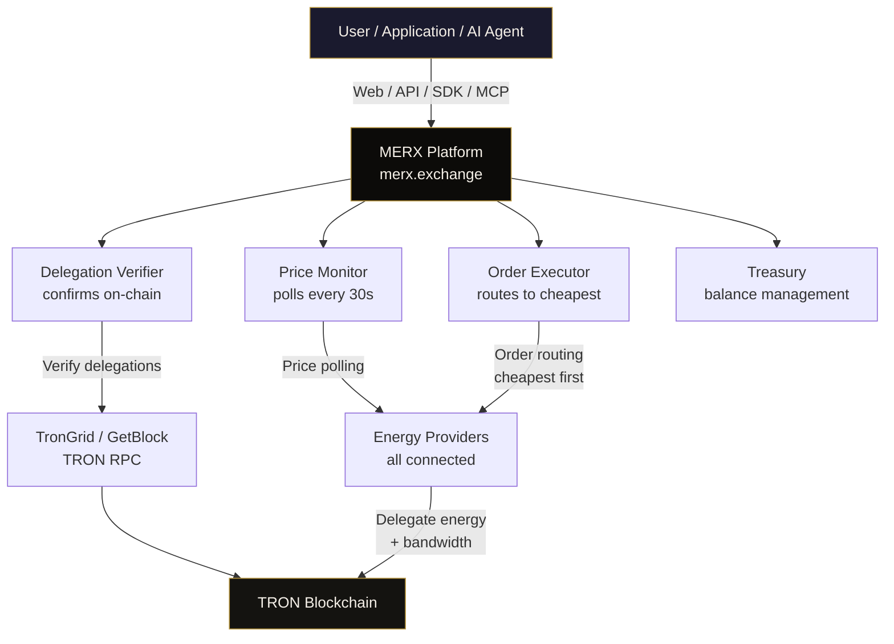
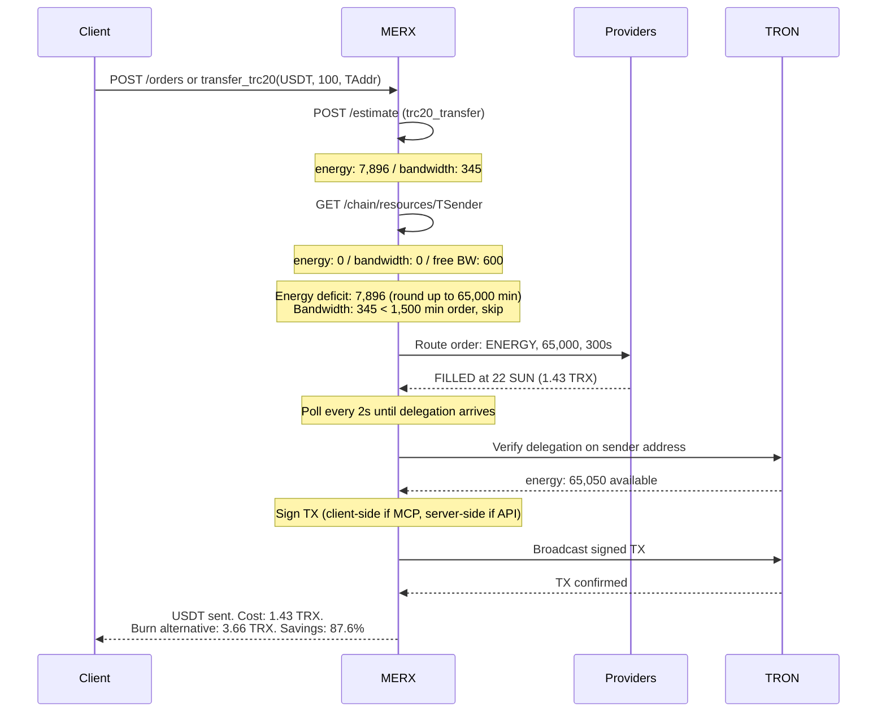

# MERX
### https://MERX.exchange

**TRON infrastructure for AI agents.**

<a href="https://glama.ai/mcp/servers/Hovsteder/merx-mcp"></a>

[](https://smithery.ai/servers/powersun/merx)
[](https://www.npmjs.com/package/merx-mcp)
[](LICENSE)


64 MCP tools. Energy market across 6 providers. USDT/USDC/USDD payments. x402 v2 facilitator on TRON mainnet.

[Documentation](https://merx.exchange/docs) | [API Reference](https://merx.exchange/docs/api) | [MCP Server](#mcp-server)

---

## Table of contents

- [What is MERX](#what-is-merx) — TRON infrastructure for AI agents
- [The problem](#the-problem) — why TRON had no agent layer until MERX
- [Platform overview](#platform-overview) — MCP, agent payment service, x402, GasFree, energy aggregator
- [Quick start](#quick-start) — 4 paths (web, REST/SDK, Claude Code plugin, MCP)
- [What sets MERX apart](#what-sets-merx-apart) — only complete agent stack on TRON
- [Architecture](#architecture)
- [API overview](#api-overview)
- [MCP server](#mcp-server)
- [SDKs](#sdks)
- [Real-time data](#real-time-data)
- [Payment methods](#payment-methods)
- [Standing orders and monitors](#standing-orders-and-monitors)
- [Savings calculator](#savings-calculator)
- [Error handling](#error-handling)
- [Security](#security)
- [Tested on mainnet](#tested-on-mainnet)
- [Comparison with alternatives](#comparison-with-alternatives)
- [Documentation](#documentation)
- [License](#license)

---

## What is MERX

**MERX is the infrastructure layer for AI agents and agentic networks on TRON.**
Where Stripe is infrastructure for web commerce and Cloudflare for the open web,
MERX is the missing infrastructure layer that lets autonomous AI agents discover,
transact, and operate on TRON without ever touching energy, bandwidth, or
low-level blockchain mechanics.

The platform exposes one coherent stack: **64-tool MCP server**, **agent payment
service** for TRC-20 stablecoins, **x402 v2 facilitator** (the only TRON
facilitator in the coinbase/x402 ecosystem registry), **GasFree transfers** via
a MERX-deployed mainnet controller, **dedicated TRON RPC node**, **A2A** (Google,
7 skills) and **ACP** (BeeAI, 7 capabilities) protocol coverage, and a **natural
language Policy Engine** powered by Anthropic Claude.

Underneath those agent surfaces sits an **energy aggregator across 6 active
providers** (CatFee, Netts, TronSave, iTRX, PowerSun, TEM) that routes resource
purchases to the cheapest source automatically -- so when an agent calls
`send()`, MERX estimates the energy required, buys only the deficit, and
broadcasts the transaction. The agent never holds TRX or thinks about energy.

**Any AI agent** running in Claude, LangChain, CrewAI, Vertex AI, AutoGen,
or BeeAI can send payments and acquire resources on TRON through a single
integration with MERX.

Three ways to plug an agent into MERX:

- **MCP server** -- 64 tools for AI agents. Hosted SSE at
  `https://merx.exchange/mcp/sse` (zero install) or local stdio via
  `npx merx-mcp`. Works with Claude, GPT, Cursor, Windsurf, and any
  MCP-compatible client.

- **Claude Code plugin** -- one-line install for Claude Code. Auto-registers
  the MCP server, ships 6 slash commands and a `tron-agent-engineer` sub-agent.
  See [Hovsteder/merx-claude-plugin](https://github.com/Hovsteder/merx-claude-plugin).

- **REST API + SDKs** -- direct programmatic access for agents that aren't
  using MCP. JavaScript (`merx-sdk` v2.1 on npm), Python (`merx-sdk` v2.1 on
  PyPI), or raw HTTP against `/api/v1/` (70+ versioned endpoints).

For human users, the web platform at [merx.exchange](https://merx.exchange)
remains available for manual energy trading, dashboard, deposits, and
withdrawals -- but the platform is built primarily for agents.

---

## The problem

AI agents will become the dominant transactional users of stablecoins, and
TRON -- home to USDD, $86B+ USDT, USDC, and the dominant chain for retail USDT
in Southeast Asia, Africa, and Latin America -- is already the largest
USDT-native network in the world.

But TRON has no infrastructure designed for agents:

- **No agent-native payment service.** Existing TRON wallets are built for
  human users with mouse clicks and seed-phrase backups, not for autonomous
  programs that need to register addresses, send TRC-20s, watch for incoming
  payments, and create invoices via REST.

- **Energy and bandwidth are a UX dead-end.** Every smart contract call on TRON
  requires energy. Without energy, TRX tokens burn as fees -- a single USDT
  transfer burns 3-13 TRX (~$1-4) for cold receivers. Renting energy from a
  provider drops the cost to ~$0.10 -- a **94% reduction** -- but every
  provider has a different price, different API, different duration tiers, and
  different failure modes. No agent can be expected to manage that.

- **No x402 facilitator on TRON before MERX.** The x402 protocol has already
  processed $43.57M in agent-to-agent payments on Base, Solana, Stellar, and
  Ethereum. TRON was completely absent from the coinbase/x402 ecosystem
  registry until MERX. Agents that wanted to pay for TRON-hosted APIs in
  USDT had no standardized way to do it.

- **Three agent protocols, zero TRON integrations.** MCP (Anthropic), A2A
  (Google), and ACP (BeeAI) are the three major agent communication protocols.
  Until MERX, none of them had a deployed, production-grade TRON server.
  AI agents in Claude, Vertex AI, or BeeAI literally could not see TRON.

MERX builds the missing layer. AI agents call one API, hold zero TRX, and
get paid / pay / send / receive in USDT, USDC, or USDD on the world's
largest USDT network.

| Without MERX | With MERX |
|---|---|
| Agent has to manage energy + bandwidth manually | `send()` estimates and provisions resources automatically |
| Agent has to hold TRX as gas | GasFree transfers — agents send stablecoins from zero-TRX wallets |
| Agent has to integrate every energy provider's API | One MERX API routes to the cheapest of 6 providers |
| No way to pay for TRON-hosted APIs in USDT | x402 v2 facilitator with full USDT/USDC/USDD support |
| No A2A/ACP discovery on TRON | Agent Card + Manifest live, 7 skills, 7 capabilities |
| Agent has to write its own MCP server for TRON | 64 tools, 30 prompts, 21 resources, hosted |
| Address watching means polling RPC | `watch()` with sub-3-second webhook delivery via ZMQ |

---

## Platform overview

| Component | Description |
|---|---|
| MCP server | **64 tools, 30 prompts, 21 resources** for AI agents. Hosted SSE at `https://merx.exchange/mcp/sse` (zero install) or local stdio. SEP-1649 server card. The largest TRON-native MCP server in production. |
| Claude Code plugin | One-line install: `/plugin marketplace add Hovsteder/merx-claude-plugin`. Auto-registers MCP, 6 slash commands, sub-agent. |
| Agent Payment Service | `agent.merx.exchange` -- non-custodial REST API. `register`, `send`, `receive`, `watch`, `invoice`, `batch`, `schedule`, `contacts`. USDT live; USDD/USDC next sprint. |
| x402 v2 Facilitator | `x402.merx.exchange` -- only TRON facilitator in the coinbase/x402 ecosystem registry. Three settlement schemes (`exact`, `exact_permit`, `exact_gasfree`) for USDT, USDC, USDD on TRON mainnet plus USDC on Base. |
| GasFree Transfer Service | Mainnet controller `TKjJ1r5XYqnLZmLakcP3knis7Lh6gm3qtR` activated 2026-04-08. TIP-712 PermitTransfer for USDT/USDC/USDD. Agents send stablecoins from zero-TRX wallets. |
| A2A Protocol (Google) | Agent Card at `/.well-known/agent.json`. **7 skills** including `compile_policy`. Task-based execution with SSE streaming. Compatible with LangChain, CrewAI, Vertex AI, AutoGen, Mastra. |
| ACP Protocol (BeeAI) | Manifest at `/.well-known/agent-manifest.json`. **7 capabilities** matching A2A skills. Run-based execution with long-polling. |
| Policy Engine | Natural language → standing orders, powered by Anthropic Claude Sonnet 4. Available as MCP tool, A2A skill, and REST endpoint. |
| Energy aggregator | Real-time price comparison across **6 active providers** (CatFee, Netts, TronSave, iTRX, PowerSun, TEM). Routes orders to cheapest source. Underneath the agent surfaces. |
| Dedicated TRON RPC node | `rpc.merx.exchange`, sub-5ms read latency, 13.7ms broadcast. Trial 1,000 free requests; paid tiers with energy-spend waiver. |
| REST API | 70+ versioned endpoints under `/api/v1/`. Idempotency-Key on POST. Standard error format. |
| WebSocket | Real-time TRC-20 transfer stream and price updates at `wss://merx.exchange/ws`. |
| JavaScript SDK | `merx-sdk` v2.1 -- AgentModule + SwapModule + 4 base modules. TypeScript types included. |
| Python SDK | `merx-sdk` v2.1 -- same surface in snake_case. |
| x402 middleware | `merx-x402` v2.0.0 -- one-line Express integration for x402 v2. |
| Documentation | 38+ pages at [merx.exchange/docs](https://merx.exchange/docs). API reference, MCP/A2A/ACP guides, x402 integration. |

---

## Quick start

Four paths depending on your use case. **For AI agents, paths 3 and 4 are the
primary surfaces.** Path 1 (web) is for human operators; path 2 (REST/SDK) is
for direct programmatic integration.

### Path 1: Web platform (humans)

Go to [merx.exchange](https://merx.exchange). Sign in. Deposit TRX. Manage
energy, agent API keys, and balance through the dashboard. No code required.

### Path 2: REST API / SDK (programmatic)

Install the JavaScript SDK:

```bash
npm install merx-sdk
```

Use it in your application (replace `merx_sk_your_key` with your API key from [merx.exchange](https://merx.exchange)):

```typescript
import { MerxClient } from 'merx-sdk'

const merx = new MerxClient({ apiKey: 'merx_sk_your_key' })

// Get current prices from all providers
const prices = await merx.prices.list()
console.log(prices[0])
// { provider: "netts", price_sun: 22, available: 100000000 }

// Buy energy at best price
const order = await merx.orders.create({
  resource_type: 'ENERGY',
  amount: 65000,
  duration_sec: 300,
  target_address: 'TYourAddress...',
})
console.log(order.status)   // "FILLED"
console.log(order.cost_trx) // 1.4311
```

Python:

```python
from merx import MerxClient

merx = MerxClient(api_key="merx_sk_your_key")

prices = merx.prices.list()
order = merx.orders.create(
    resource_type="ENERGY",
    amount=65000,
    duration_sec=300,
    target_address="TYourAddress..."
)
```

curl (no SDK needed):

```bash
# Public -- no auth required
curl https://merx.exchange/api/v1/prices

# Authenticated
curl -X POST https://merx.exchange/api/v1/orders \
  -H "Authorization: Bearer merx_sk_your_key" \
  -H "Content-Type: application/json" \
  -d '{
    "resource_type": "ENERGY",
    "amount": 65000,
    "duration_sec": 300,
    "target_address": "TYourAddress..."
  }'
```

### Path 3: Claude Code plugin (one-line install)

If you're using Claude Code, this is the fastest path. The plugin auto-registers
the hosted MCP server, ships 6 slash commands, and includes a
`tron-agent-engineer` sub-agent specialized in agentic payment workflows on TRON.

```
/plugin marketplace add Hovsteder/merx-claude-plugin
/plugin install merx@merx
```

Then run `/merx:setup` to configure your MERX API key. Available commands:

| Command | What it does |
|---|---|
| `/merx:setup` | First-time setup: API key, connection test, capability tour |
| `/merx:prices` | Live TRON energy and bandwidth prices across all providers |
| `/merx:buy-energy` | Buy energy via cheapest provider, delegated to a target address |
| `/merx:balance` | MERX prepaid balance, recent orders, free-tier usage |
| `/merx:tx` | Look up a TRON transaction with structured fields |
| `/merx:send` | Send TRC-20 stablecoin via the agent payment service |

Source: [github.com/Hovsteder/merx-claude-plugin](https://github.com/Hovsteder/merx-claude-plugin).

### Path 4: MCP for any AI agent (Claude, Cursor, Windsurf, custom)

**Hosted (zero install)** -- works with Claude.ai, Cursor, Windsurf, and any
SSE-compatible MCP client:

```json
{
  "mcpServers": {
    "merx": {
      "url": "https://merx.exchange/mcp/sse"
    }
  }
}
```

22 read-only tools are available immediately: prices, estimation, market analysis,
on-chain queries, address lookups. No API key required.

To unlock trading tools, call `set_api_key` in any conversation:

```
set_api_key("merx_sk_your_key")
-> All 34 authenticated tools unlocked for this session.
```

To unlock write tools (send TRX, swap tokens), call `set_private_key`:

```
set_private_key("your_64_char_hex_key")
-> Address derived automatically. All 64 tools available.
-> Key never leaves your machine.
```

**Local (stdio)** -- full power with keys set via environment variables:

```bash
npm install -g merx
```

```json
{
  "mcpServers": {
    "merx": {
      "command": "npx merx-mcp",
      "env": {
        "MERX_API_KEY": "merx_sk_your_key",
        "TRON_PRIVATE_KEY": "your_private_key"
      }
    }
  }
}
```

All 64 tools available from the first message.

### Additional protocol support

MERX also exposes A2A and ACP for non-MCP orchestrators -- same backend, different
discovery surface:

- **A2A** (LangChain, CrewAI, Vertex AI, AutoGen, Mastra): Agent Card at
  [https://merx.exchange/.well-known/agent.json](https://merx.exchange/.well-known/agent.json) -- 7 skills, SSE streaming
- **ACP** (BeeAI): Manifest at
  [https://merx.exchange/.well-known/agent-manifest.json](https://merx.exchange/.well-known/agent-manifest.json) -- 7 capabilities, run-based execution

### Access levels

| Configuration | Tools | Capabilities |
|---|---|---|
| No keys | 22 | Prices, estimation, market analysis, on-chain queries, address lookups |
| + `MERX_API_KEY` | 34 | + Orders, balance, deposits, standing orders, monitors |
| + `TRON_PRIVATE_KEY` | 64 | + Send TRX/USDT/USDC/USDD, swap tokens, approve contracts, execute intents, agent payments |

---

## What sets MERX apart

### The only complete agent stack on TRON

MERX is the only TRON project that runs **all three major agent protocols** as
production-grade services: MCP (Anthropic), A2A (Google, 7 skills), and ACP
(BeeAI, 7 capabilities). TronLink published a core MCP library
(`@tronlink/tronlink-mcp-core` v0.1.0, March 2026) but it is explicitly a
building block, not a hosted service. MERX is the only TRON entry in the
[coinbase/x402 ecosystem partner registry](https://github.com/coinbase/x402/tree/main/partners-data).

### Agent payment service with sub-3-second receive

`agent.merx.exchange` is non-custodial: agents register their own TRON address
and MERX never holds private keys or controls funds. The ZMQ event listener
matches incoming TRC-20 transfers (USDT, USDC, USDD, plus any other token in
real time) and dispatches webhooks within ~3 seconds of on-chain confirmation.
`watch()` provides persistent 24/7 address monitoring with per-token filtering.
`invoice()` creates payment requests with payment links and automatic
detection. `batch()` sends up to 50 transfers in one call.

### x402 v2 facilitator with full TRON stablecoin coverage

`x402.merx.exchange` implements the standard `/verify`, `/settle`, and
`/supported` endpoints, so any x402 client (including the Coinbase CDP
reference implementation) interoperates out of the box. **Three settlement
schemes live on TRON mainnet**: `exact` (direct TRC-20 transfer),
`exact_permit` and `exact_gasfree` (TIP-712 PermitTransfer through MERX's own
GasFreeController contract). USDT, USDC, and USDD all settled on mainnet
with verified txids and on-chain commission collection. Among 15 known x402
facilitators, MERX is the only one supporting the full TRON stablecoin set.

### GasFree zero-TRX sends

The MERX-deployed GasFreeController contract `TKjJ1r5XYqnLZmLakcP3knis7Lh6gm3qtR`
went live on mainnet 2026-04-08 with three verified mainnet `permitTransfer`
settlements (USDT, USDC, USDD). Agents send stablecoins from wallets that
hold zero TRX -- the controller pulls value+fee from a per-user GasFree
subaccount and the executor pays the broadcast gas. Single biggest UX barrier
for agents on TRON, removed.

### Resource-aware transactions

Every write operation (TRC-20 transfer, token swap, contract call) automatically
estimates energy AND bandwidth needed, buys the deficit at the best market
price across 6 providers, waits for delegation to arrive on-chain, then
executes. The agent never burns TRX unnecessarily. Tested on mainnet:
a USDT transfer with auto-resources saves up to 94% compared to burning.

### Exact energy simulation

Before buying energy for swaps and contract calls, MERX simulates the exact
transaction via `triggerConstantContract` with real parameters. No hardcoded
estimates -- the precise energy amount is purchased. For a SunSwap V2 swap,
simulation returned 223,354 energy; the on-chain transaction used exactly
223,354.

### Natural language Policy Engine

> "Keep 500,000 energy on my wallet. Buy when price drops below 55 SUN.
> Max 200 TRX per week."

The Policy Engine (powered by Anthropic Claude Sonnet 4) parses this
instruction, generates structured standing orders with triggers, budget
limits, and expiration, previews them for the user, and creates everything
with one confirmation. Available through MCP, A2A skill, and REST endpoint.
No competitor can replicate this without their own Anthropic integration,
standing order infrastructure, and real-time provider price feeds.

### Multi-provider energy routing (under the agent surfaces)

All 6 active energy providers are aggregated (CatFee, Netts, TronSave, iTRX,
PowerSun, TEM). Orders are routed to the cheapest source automatically. If
one provider fails or runs out of capacity, the next cheapest fills the order.
Prices cover both energy and bandwidth across every available duration tier.

### Standing orders + delegation monitors

Server-side 24/7 automation stored in PostgreSQL. Trigger types: `price_below`,
`price_above`, `schedule` (cron), `balance_below`, `delegation_expiry`.
Persists across restarts. Works when the client is offline. Auto-renew with
configurable max price.

### Full MCP protocol

The only TRON MCP server using all three MCP primitives: **tools (64), prompts
(30), and resources (21 -- 14 static + 7 templates)**. Two transport modes:
hosted SSE (zero install) and local stdio (full key management). Three
protocol versions supported: `2024-11-05`, `2025-03-26`, `2025-06-18`.

---

## Architecture

### Platform overview



<details>
<summary>ASCII diagram (if Mermaid does not render)</summary>

```
User / Application / AI Agent
    |
    | Web / REST API / SDK / MCP
    v
+----------------------------------+
|         MERX Platform            |
|         merx.exchange            |
|                                  |
|  +------------+ +-------------+  |
|  |   Price    | |   Order     |  |
|  |  Monitor   | |  Executor   |  |
|  | (every 30s)| | (cheapest)  |  |
|  +------------+ +-------------+  |
|  +------------+ +-------------+  |
|  | Delegation | |  Treasury   |  |
|  |  Verifier  | |  Manager    |  |
|  +------------+ +-------------+  |
+----------------------------------+
    |                    |
    v                    v
TronGrid / GetBlock   Energy Providers
(TRON RPC)            (all connected)
    |                    |
    v                    v
+----------------------------------+
|        TRON Blockchain           |
+----------------------------------+
```

</details>

**Key architecture principle:** All traffic goes through the MERX platform. Users
never need TronGrid API keys. MERX manages all RPC infrastructure, caching, and
failover server-side. The only operation that stays on the client: transaction
signing with a private key. Private keys never leave the client process.

### Resource-aware transaction flow

This sequence diagram shows a real USDT transfer with auto-resource optimization.
Numbers are from production testing.



<details>
<summary>ASCII diagram (if Mermaid does not render)</summary>

```
Client                  MERX                    Providers               TRON
  |                       |                       |                      |
  | order / transfer      |                       |                      |
  |---------------------->|                       |                      |
  |                       | estimate energy+BW    |                      |
  |                       | energy: 7,896         |                      |
  |                       | bandwidth: 345        |                      |
  |                       |                       |                      |
  |                       | check sender resources|                      |
  |                       | energy: 0, BW: 0      |                      |
  |                       |                       |                      |
  |                       | [deficit: 7,896 -> round up to 65,000]      |
  |                       | [BW: 345 < 1,500 min -> skip, burn ~0.3 TRX]|
  |                       |                       |                      |
  |                       | route to cheapest     |                      |
  |                       |---------------------->|                      |
  |                       |   FILLED 22 SUN       |                      |
  |                       |   1.43 TRX            |                      |
  |                       |<----------------------|                      |
  |                       |                       |                      |
  |                       | [poll until delegation arrives]              |
  |                       |                       |                      |
  |                       | verify delegation     |--------------------->|
  |                       |   energy: 65,050      |<---------------------|
  |                       |                       |                      |
  |                       | [sign + broadcast]    |                      |
  |                       |---------------------->|--------------------->|
  |                       |                       |   TX confirmed       |
  |                       |<----------------------|<---------------------|
  |                       |                       |                      |
  |   USDT sent           |                       |                      |
  |   Cost: 1.43 TRX      |                       |                      |
  |   Burn alt: 3.66 TRX  |                       |                      |
  |   Savings: 87.6%      |                       |                      |
  |<----------------------|                       |                      |
```

</details>

### Resource purchase rules

| Rule | Details |
|---|---|
| Energy deficit > 0 | Round up to minimum 65,000 units. Cheaper to buy minimum than to burn even small deficits. |
| Bandwidth deficit < 1,500 | Skip purchase, let network burn ~0.3 TRX. Cheaper than minimum bandwidth order. |
| After energy purchase | Poll `check_address_resources` every 2 seconds until delegation arrives on-chain. Never broadcast TX before delegation is confirmed. |
| DEX swaps | Simulate exact energy via `triggerConstantContract` with real swap parameters. No hardcoded estimates. |

---

## API overview

Base URL: `https://merx.exchange/api/v1`

All endpoints are versioned. Errors follow a standard format:
`{ "error": { "code": "...", "message": "...", "details": { ... } } }`.
Idempotency-Key header supported on `POST /orders` and `POST /withdraw`.

### Public endpoints (no authentication)

| Method | Endpoint | Description |
|---|---|---|
| GET | `/prices` | Current energy and bandwidth prices from all providers |
| GET | `/prices/best` | Cheapest provider for given resource and amount |
| GET | `/prices/history` | Historical price snapshots by provider and period |
| GET | `/prices/stats` | Price statistics: min, max, average, percentiles |
| GET | `/prices/analysis` | Market analysis with trends and recommendations |
| GET | `/orders/preview` | Preview order cost without creating it |
| POST | `/estimate` | Estimate energy and bandwidth for any transaction type |
| GET | `/chain/account/:address` | On-chain account info |
| GET | `/chain/resources/:address` | Energy, bandwidth, and free BW for any address |
| GET | `/chain/transaction/:txid` | Transaction details by ID |
| GET | `/chain/block/:number` | Block info by number or latest |
| GET | `/chain/parameters` | TRON network parameters |

### Authenticated endpoints (API key required)

| Method | Endpoint | Description |
|---|---|---|
| POST | `/orders` | Create order -- routed to cheapest provider |
| GET | `/orders` | List orders with optional status filter |
| GET | `/orders/:id` | Order details with fills, TX hashes, verification |
| GET | `/balance` | MERX account balance (TRX, USDT, locked) |
| GET | `/deposit/info` | Deposit address and memo |
| POST | `/withdraw` | Withdraw TRX to external address |
| GET | `/history` | Account transaction history |
| GET | `/history/summary` | History summary with totals |
| POST | `/keys` | Create new API key |
| GET | `/keys` | List API keys |
| DELETE | `/keys/:id` | Revoke API key |
| POST | `/webhooks` | Register webhook endpoint |
| GET | `/webhooks` | List registered webhooks |
| DELETE | `/webhooks/:id` | Remove webhook |
| POST | `/ensure` | Ensure minimum resources on an address |
| POST | `/standing-orders` | Create server-side standing order |
| GET | `/standing-orders` | List standing orders |
| POST | `/monitors` | Create delegation or balance monitor |
| GET | `/monitors` | List monitors |

### x402 endpoints (zero registration)

| Method | Endpoint | Description |
|---|---|---|
| POST | `/x402/invoice` | Create payment invoice |
| POST | `/x402/verify` | Verify invoice payment |

Full API reference: [merx.exchange/docs/api](https://merx.exchange/docs/api)

---

## MCP server

MERX provides a full MCP (Model Context Protocol) server for AI agents. 64 tools
across 18 categories, 30 pre-built prompts, and 21 live data resources.

> **Note:** the tool catalog table below was last fully audited at 52 tools.
> Twelve newer tools (agent payment service, swap module, advanced standing
> orders) are documented at [merx.exchange/docs/tools/mcp-server](https://merx.exchange/docs/tools/mcp-server).
> The canonical count is **64**, served by the live MCP server.

### Tool categories

| Category | Count | Auth | Description |
|---|---|---|---|
| Price Intelligence | 5 | -- | Real-time prices from all providers, market analysis, trends, history |
| Resource Estimation | 2 | -- | Estimate energy + bandwidth for any transaction type |
| Resource Trading | 4 | API key | Buy energy/bandwidth at best price, ensure resources on any address |
| Account Management | 3 | API key | Balance, deposit info, transaction history |
| Agent Convenience | 4 | -- | Explain concepts, suggest durations, calculate savings, list providers |
| On-chain Queries | 5 | -- | Account info, TRX/TRC20 balances, transaction lookup, blocks |
| Token Operations | 4 | Private key | Send TRX, transfer TRC20, approve tokens -- all resource-aware |
| Smart Contracts | 3 | Mixed | Read contract state, estimate call cost, execute with auto-resources |
| Network Utilities | 5 | -- | Chain parameters, address tools, TRX price, on-chain history |
| DEX Swaps | 3 | Private key | SunSwap V2 quotes, execution with exact energy simulation |
| Onboarding | 2 | -- | Create account + login, no browser needed |
| Payments | 4 | Mixed | Self-deposit, auto-deposit config, x402 pay-per-use |
| Intent Execution | 2 | Mixed | Multi-step plans: simulate or execute complex sequences |
| Standing Orders | 4 | API key | Server-side 24/7 automation: price triggers, cron, monitors |
| Session Management | 2 | -- | Set API key and private key for current session |
| **Total** | **52** | | |

### Prompts (30)

Pre-built conversation templates available in Claude Desktop prompt picker and via
`prompts/get` in any MCP client.

| Group | Prompts | Examples |
|---|---|---|
| Market (5) | buy-energy, buy-bandwidth, ensure-resources, market-analysis, compare-providers | "Buy energy at best market price" |
| Transactions (5) | send-usdt, send-trx, send-token, multi-transfer, explain-transaction | "Send USDT with auto resource optimization" |
| Wallet (4) | check-wallet, audit-spending, monitor-delegations, optimize-wallet | "Full wallet overview with balances and delegations" |
| DEX (3) | swap-tokens, check-token, price-check | "Swap tokens via SunSwap" |
| Planning (3) | estimate-costs, budget-plan, stake-vs-rent | "Plan energy budget for a period" |
| Developer (2) | integrate-merx, setup-mcp | "How to integrate MERX API" |
| Onboarding (2) | onboard, fund-account | "Create account and get started" |
| Payments (2) | setup-auto-funding, buy-without-account | "x402 zero-registration purchase" |
| Simulation (2) | simulate-plan, execute-plan | "Simulate a multi-step plan" |
| Monitoring (2) | setup-standing-order, auto-renew-delegations | "Set up auto-renewal for delegations" |

### Resources (21)

14 static resources + 7 URI templates. Attach to conversations as context or
subscribe for real-time updates.

| Resource | URI | Updates |
|---|---|---|
| Energy prices | `merx://prices/energy` | Every 30s |
| Bandwidth prices | `merx://prices/bandwidth` | Every 30s |
| Best price | `merx://prices/best` | Every 30s |
| Market analysis | `merx://market/analysis` | Every 5m |
| Provider list | `merx://market/providers` | Every 30s |
| Provider status | `merx://market/providers/status` | Every 30s |
| Account balance | `merx://account/balance` | On change |
| Recent orders | `merx://account/orders/recent` | On change |
| Account stats | `merx://account/stats` | Every 5m |
| Auto-deposit config | `merx://account/auto-deposit` | On change |
| Network parameters | `merx://network/parameters` | Every 1h |
| TRX price | `merx://network/trx-price` | Every 1m |
| Token reference | `merx://reference/tokens` | Static |
| Standing orders | `merx://standing-orders/active` | On change |

**URI Templates:**

| Template | Description |
|---|---|
| `merx://address/{address}/overview` | Full address state: TRX, tokens, energy, bandwidth |
| `merx://address/{address}/resources` | Energy + bandwidth with free BW tracking |
| `merx://address/{address}/transactions` | Recent transactions with type and amounts |
| `merx://address/{address}/delegations` | Active delegations with expiry times |
| `merx://token/{token}/info` | Token metadata + price + transfer energy cost |
| `merx://order/{order_id}/status` | Order details with fills and cost breakdown |
| `merx://standing-order/{id}/status` | Standing order trigger state and executions |

### Example conversations

**Check prices and buy energy:**

```
User: What is the cheapest energy right now?
Agent: [calls get_prices] Cheapest energy is 22 SUN from Netts (5-minute
       delegation). For 65,000 energy, that is 1.43 TRX.
User: Buy it for TLyqz...
Agent: [calls create_order] Done. 65,050 energy delegated via Netts.
       Cost: 1.43 TRX. TX: 27ab0019... (verified on-chain).
```

**Resource-aware USDT transfer:**

```
User: Send 100 USDT to TAddr.
Agent: [calls transfer_trc20] MERX estimated 7,896 energy needed,
       bought 65,000 at 22 SUN, waited for delegation, signed and
       broadcast. USDT sent. Cost: 1.43 TRX instead of 3.66 TRX.
       Savings: 87.6%.
```

**Market analysis:**

```
User: Is now a good time to buy energy?
Agent: [calls analyze_prices] Energy is at 22 SUN -- the 1st percentile
       of the last 7 days. 64% below the weekly average of 62 SUN.
       Trend: falling. Recommendation: good time to buy.
```

### Full tool reference

All 64 tools with auth requirements. For input schemas and output examples, see
[docs/TOOLS.md](docs/TOOLS.md).

**Price Intelligence**

| # | Tool | Description | Auth |
|---|---|---|---|
| 1 | `get_prices` | Current energy and bandwidth prices from all providers | -- |
| 2 | `get_best_price` | Cheapest provider for given resource and amount | -- |
| 3 | `analyze_prices` | Market analysis with trends, percentile, and recommendation | -- |
| 4 | `get_price_history` | Historical price snapshots by provider, resource, and period | -- |
| 5 | `compare_providers` | Side-by-side provider comparison with all duration tiers | -- |

**Resource Estimation**

| # | Tool | Description | Auth |
|---|---|---|---|
| 6 | `estimate_transaction_cost` | Estimate energy + bandwidth for TRX/TRC20/custom operations | -- |
| 7 | `check_address_resources` | Energy, bandwidth, free BW, and TRX balance for any address | -- |

**Resource Trading**

| # | Tool | Description | Auth |
|---|---|---|---|
| 8 | `create_order` | Buy energy or bandwidth, routed to cheapest provider | API key |
| 9 | `get_order` | Order details with fills, TX hashes, and verification status | API key |
| 10 | `list_orders` | List orders with optional status filter | API key |
| 11 | `ensure_resources` | Declarative: ensure minimum energy/bandwidth on an address | API key |

**Account Management**

| # | Tool | Description | Auth |
|---|---|---|---|
| 12 | `get_balance` | MERX account balance (TRX, USDT, locked) | API key |
| 13 | `get_deposit_info` | MERX deposit address and memo | API key |
| 14 | `get_transaction_history` | MERX account order history (7D/30D/90D) | API key |

**Agent Convenience**

| # | Tool | Description | Auth |
|---|---|---|---|
| 15 | `explain_concept` | Explain TRON concepts: energy, bandwidth, staking, delegation, sun_units | -- |
| 16 | `suggest_duration` | Recommend rental duration based on use case and TX count | -- |
| 17 | `calculate_savings` | Calculate savings from renting vs burning for N transactions | -- |
| 18 | `list_providers` | All providers with types, durations, and availability | -- |

**On-chain Queries**

| # | Tool | Description | Auth |
|---|---|---|---|
| 19 | `get_account_info` | Full on-chain account: TRX, energy, bandwidth, limits | -- |
| 20 | `get_trx_balance` | Quick TRX balance for any address | -- |
| 21 | `get_trc20_balance` | TRC-20 token balance (supports symbol or contract address) | -- |
| 22 | `get_transaction` | Look up transaction by ID with status, energy, bandwidth used | -- |
| 23 | `get_block` | Block info by number (or latest) | -- |

**Token Operations**

| # | Tool | Description | Auth |
|---|---|---|---|
| 24 | `transfer_trx` | Send TRX with auto bandwidth optimization | Private key |
| 25 | `transfer_trc20` | Transfer TRC-20 tokens with auto energy + bandwidth | Private key |
| 26 | `approve_trc20` | Approve TRC-20 spending allowance with auto energy | Private key |
| 27 | `get_token_info` | Token metadata: name, symbol, decimals, total supply | -- |

**Smart Contracts**

| # | Tool | Description | Auth |
|---|---|---|---|
| 28 | `read_contract` | Call view/pure contract functions (no gas, no signing) | -- |
| 29 | `estimate_contract_call` | Estimate energy + bandwidth for a contract call | -- |
| 30 | `call_contract` | Execute state-changing contract function with auto resources | Private key |

**Network Utilities**

| # | Tool | Description | Auth |
|---|---|---|---|
| 31 | `get_chain_parameters` | TRON network parameters with MERX price comparison | -- |
| 32 | `convert_address` | Convert between base58 (T...) and hex (41...) formats | -- |
| 33 | `get_trx_price` | Current TRX price from CoinGecko | -- |
| 34 | `validate_address` | Validate TRON address format and check on-chain status | -- |
| 35 | `search_transaction_history` | On-chain transaction history for any address | -- |

**DEX Swaps**

| # | Tool | Description | Auth |
|---|---|---|---|
| 36 | `get_swap_quote` | Real SunSwap V2 quote with expected output and slippage | -- |
| 37 | `execute_swap` | Execute SunSwap swap with exact energy simulation | Private key |
| 38 | `get_token_price` | Token price via SunSwap pools + CoinGecko USD rate | -- |

**Onboarding**

| # | Tool | Description | Auth |
|---|---|---|---|
| 39 | `create_account` | Create MERX account and get API key | -- |
| 40 | `login` | Log in to existing MERX account | -- |

**Payments**

| # | Tool | Description | Auth |
|---|---|---|---|
| 41 | `deposit_trx` | Deposit TRX to MERX from wallet (signs TX with memo) | API key + Private key |
| 42 | `enable_auto_deposit` | Configure auto-deposit when balance drops below threshold | API key |
| 43 | `pay_invoice` | Pay an existing x402 invoice | Private key |
| 44 | `create_paid_order` | x402 zero-registration order: invoice, pay, verify, order | Private key |

**Intent Execution**

| # | Tool | Description | Auth |
|---|---|---|---|
| 45 | `execute_intent` | Execute multi-step plan with resource optimization | API key |
| 46 | `simulate` | Simulate multi-step plan without executing | -- |

**Standing Orders and Monitors**

| # | Tool | Description | Auth |
|---|---|---|---|
| 47 | `create_standing_order` | Create server-side standing order with trigger + action | API key |
| 48 | `list_standing_orders` | List standing orders with status filter | API key |
| 49 | `create_monitor` | Create persistent monitor (delegation, balance, price) | API key |
| 50 | `list_monitors` | List monitors with status filter | API key |

**Session Management**

| # | Tool | Description | Auth |
|---|---|---|---|
| 51 | `set_api_key` | Set MERX API key for this session | -- |
| 55 | `set_private_key` | Set TRON private key for this session (address auto-derived) | -- |

---

## SDKs

### JavaScript / TypeScript

```bash
npm install merx-sdk
```

```typescript
import { MerxClient } from 'merx-sdk'

const merx = new MerxClient({ apiKey: 'merx_sk_your_key' })

// 4 modules: prices, orders, balance, webhooks
const prices   = await merx.prices.list()
const best     = await merx.prices.best({ resource: 'ENERGY' })
const order    = await merx.orders.create({ ... })
const status   = await merx.orders.get(order.id)
const balance  = await merx.balance.get()
const webhooks = await merx.webhooks.list()
```

| Property | Value |
|---|---|
| Package | `merx-sdk` |
| Modules | `prices`, `orders`, `balance`, `webhooks` |
| Methods | 16 |
| TypeScript | Full type definitions included |
| Dependencies | Zero |
| Node.js | 18+ |

### Python

```bash
pip install merx-sdk
```

```python
from merx import MerxClient

merx = MerxClient(api_key="merx_sk_your_key")

# Same 4 modules, snake_case
prices  = merx.prices.list()
best    = merx.prices.best(resource="ENERGY")
order   = merx.orders.create(resource_type="ENERGY", amount=65000, ...)
status  = merx.orders.get(order.id)
balance = merx.balance.get()
```

| Property | Value |
|---|---|
| Package | `merx-sdk` |
| Modules | `prices`, `orders`, `balance`, `webhooks` |
| Methods | 16 |
| Type hints | Full type annotations |
| Dependencies | Zero |
| Python | 3.11+ |

### REST API

No SDK required. All endpoints accept JSON and return JSON.

```bash
# Get prices (public, no auth)
curl https://merx.exchange/api/v1/prices

# Get best price for energy
curl https://merx.exchange/api/v1/prices/best?resource=ENERGY

# Create order (authenticated)
curl -X POST https://merx.exchange/api/v1/orders \
  -H "Authorization: Bearer merx_sk_your_key" \
  -H "Content-Type: application/json" \
  -d '{"resource_type":"ENERGY","amount":65000,"duration_sec":300,"target_address":"TAddr..."}'

# Check balance
curl https://merx.exchange/api/v1/balance \
  -H "Authorization: Bearer merx_sk_your_key"
```

---

## Real-time data

### WebSocket

Connect to `wss://merx.exchange/ws` for real-time price updates.

```javascript
const ws = new WebSocket('wss://merx.exchange/ws')

ws.onopen = () => {
  // Subscribe to all energy price updates
  ws.send(JSON.stringify({ type: 'subscribe', channel: 'prices', resource: 'ENERGY' }))
}

ws.onmessage = (event) => {
  const data = JSON.parse(event.data)
  // { provider: "netts", resource: "ENERGY", price_sun: 22, available: 100000000, ... }
}
```

| Property | Value |
|---|---|
| Endpoint | `wss://merx.exchange/ws` |
| Channels | `prices`, `orders`, `balance` |
| Update frequency | Every 30 seconds for prices |
| Heartbeat | Every 30 seconds |
| Reconnect | Client-side with exponential backoff recommended |

### Webhooks

Register webhook endpoints to receive HTTP POST notifications for account events.

```bash
curl -X POST https://merx.exchange/api/v1/webhooks \
  -H "Authorization: Bearer merx_sk_your_key" \
  -H "Content-Type: application/json" \
  -d '{"url":"https://your-app.com/webhook","events":["order.filled","deposit.received"]}'
```

| Event | Fired when |
|---|---|
| `order.filled` | Energy or bandwidth order has been filled by a provider |
| `order.failed` | Order failed after all provider attempts exhausted |
| `deposit.received` | TRX deposit confirmed and credited to balance |
| `withdrawal.completed` | TRX withdrawal broadcast and confirmed on-chain |

**Security:** Every webhook request includes an `X-Merx-Signature` header containing
an HMAC-SHA256 signature computed with your webhook secret. Verify this signature
before processing. Failed deliveries are retried with exponential backoff.

---

## Payment methods

MERX supports three ways to pay for energy and bandwidth.

### 1. Pre-funded MERX balance

Deposit TRX to your MERX account via the dashboard at merx.exchange or via the API.
Trade directly from your balance. Best for high-volume users and teams.

```bash
# Check balance
curl https://merx.exchange/api/v1/balance \
  -H "Authorization: Bearer merx_sk_your_key"

# Response
# { "available_trx": 45.20, "locked_trx": 1.43, "total_trx": 46.63 }
```

### 2. Self-deposit from agent wallet

The agent deposits TRX to MERX from its own wallet using the `deposit_trx` tool or
API. The tool builds a TRX transfer with the correct memo, signs it locally, and
broadcasts. Balance is credited in 1-2 minutes.

```
deposit_trx(amount: 10)
-> TX: 4bc60854f828...8ddcd509
-> 10 TRX deposited. Will be credited to your MERX balance shortly.
```

### 3. x402 pay-per-use

No account needed. No pre-deposit. Create an invoice, pay with TRX from any wallet,
and receive energy delegation directly. Complete flow in one API call or one tool
call via `create_paid_order`.

```
create_paid_order(amount: 65000, duration_sec: 300,
  resource_type: "ENERGY", target_address: "THT49...")
-> Invoice: inv_f41ffc2f...
-> Payment TX: 53236a5a...
-> Cost: 1.43 TRX
-> Status: PENDING -> FILLED
-> 65,050 energy delegated to THT49...
```

| Method | Setup required | Best for | Min deposit |
|---|---|---|---|
| Pre-funded balance | Account + dashboard deposit | High-volume users, teams | Any amount |
| Self-deposit (`deposit_trx`) | API key + private key | Autonomous agents | Any amount |
| x402 (`create_paid_order`) | Private key only | One-off purchases, no-account agents | Per-order |

See [docs/PAYMENT-METHODS.md](docs/PAYMENT-METHODS.md) for detailed flow diagrams.

---

## Standing orders and monitors

### Standing orders

Server-side 24/7 automation stored in PostgreSQL. Persists across restarts. Works
when the client is offline.

**Trigger types:**

| Trigger | Description | Example |
|---|---|---|
| `price_below` | Fire when best price drops below threshold | Buy 65,000 energy when price < 20 SUN |
| `price_above` | Fire when best price exceeds threshold | Alert when energy exceeds 50 SUN |
| `schedule` | Cron-based schedule | Buy energy every day at 03:00 UTC |
| `balance_below` | Fire when MERX balance drops below threshold | Auto-deposit 50 TRX when balance < 10 TRX |

**Action types:**

| Action | Description |
|---|---|
| `buy_resource` | Buy specified amount of energy or bandwidth |
| `ensure_resources` | Ensure minimum resources on target address |
| `notify_only` | Send notification via webhook |

**Example:**

```
create_standing_order(
  trigger: { type: "price_below", resource: "ENERGY", threshold_sun: 20 },
  action: { type: "buy_resource", amount: 65000, duration_sec: 300 },
  target_address: "TLyqz...",
  max_executions: 10,
  budget_trx: 15
)

-> Standing Order: so_a1b2c3d4
-> Status: ACTIVE
-> Trigger: ENERGY price < 20 SUN
-> Action: Buy 65,000 energy (5m)
-> Budget: 15 TRX (10 executions max)
```

### Delegation monitors

Watch delegations and resources on any address. Alert before expiry. Auto-renew
with configurable max price.

| Monitor type | Description | Example |
|---|---|---|
| `delegation_expiry` | Alert before energy/bandwidth delegation expires | Alert 5 minutes before expiry, auto-renew at max 30 SUN |
| `balance_threshold` | Alert when TRX balance drops below threshold | Alert when balance < 5 TRX |
| `price_alert` | Alert on price movements | Alert when energy price drops below 20 SUN |

**Example:**

```
create_monitor(
  type: "delegation_expiry",
  address: "TLyqz...",
  resource: "ENERGY",
  alert_before_sec: 300,
  auto_renew: true,
  max_price_sun: 30
)

-> Monitor: mon_e5f6g7h8
-> Status: ACTIVE
-> Type: delegation_expiry
-> Alert: 5 minutes before expiry
-> Auto-renew: Yes (max 30 SUN)
```

---

## Savings calculator

Energy is the expensive resource on TRON. These numbers show the cost difference
between burning TRX (no energy) and renting energy through MERX.

| Resource | Purpose | Free daily | Without it |
|---|---|---|---|
| Energy | Smart contract execution (USDT transfers, swaps, approvals) | 0 (must stake or rent) | TRX burned at network rate |
| Bandwidth | Transaction serialization (every TX needs some) | 600 bytes/day | TRX burned at network rate |

### Cost comparison

| Scenario | Burn cost (no energy) | Rental cost (MERX) | Savings |
|---|---|---|---|
| 1 USDT transfer | 3-13 TRX | 1.43 TRX | 56-89% |
| 10 USDT transfers | 30-130 TRX | 14.30 TRX | 52-89% |
| 100 USDT transfers/day | 300-1,300 TRX | 143 TRX | 52-89% |
| SunSwap swap (small) | ~50 TRX | ~4.91 TRX | ~90% |
| Contract call (simple) | ~1 TRX | ~0.09 TRX | ~91% |

Numbers assume the cheapest available provider at time of order. Actual burn cost
varies by recipient address state (whether it has held the token before).

### How it works

1 TRX = 1,000,000 SUN. Energy is priced in SUN per unit. A USDT transfer needs
approximately 65,000 energy units. At 22 SUN per unit, that is 65,000 x 22 =
1,430,000 SUN = 1.43 TRX. Without energy, the network burns 3-13 TRX from the
sender depending on the recipient's account state.

---

## Error handling

All errors follow a standard format across API, SDKs, and MCP:

```json
{
  "error": {
    "code": "INSUFFICIENT_BALANCE",
    "message": "MERX balance too low. Need 1.43 TRX, have 0.50 TRX.",
    "details": {
      "required_trx": 1.43,
      "available_trx": 0.50
    }
  }
}
```

### Common error codes

| Code | Description | Resolution |
|---|---|---|
| `INSUFFICIENT_BALANCE` | MERX account balance too low | Deposit TRX via dashboard or `deposit_trx` |
| `PROVIDER_UNAVAILABLE` | All providers failed for this order | Try again later or increase max price |
| `INVALID_ADDRESS` | TRON address format invalid | Check address starts with T and is 34 characters |
| `DELEGATION_TIMEOUT` | Energy delegation did not arrive within timeout | Check order status with `get_order` |
| `SIMULATION_FAILED` | Contract call simulation failed | Check contract address and function parameters |
| `PRIVATE_KEY_REQUIRED` | Operation requires TRON private key | Set `TRON_PRIVATE_KEY` env var or call `set_private_key` |
| `API_KEY_REQUIRED` | Operation requires MERX API key | Set `MERX_API_KEY` env var or call `set_api_key` |
| `ORDER_MIN_AMOUNT` | Amount below minimum order size | Energy minimum: 65,000. Bandwidth minimum: 1,500 |

---

## Security

### Private key handling

- Private keys are set via environment variable (`TRON_PRIVATE_KEY`) or the
  `set_private_key` tool in-session.
- Keys never leave the client process. All transaction signing happens locally.
- The MERX API never receives private keys.
- The `set_private_key` tool derives the TRON address automatically -- the user
  only provides the 64-character hex key.

### API key handling

- API keys authenticate with the MERX API for trading operations.
- Keys can be set via environment variable (`MERX_API_KEY`) or the `set_api_key`
  tool in-session.
- Create an account and get an API key without leaving the conversation using the
  `create_account` tool.

### What MERX can and cannot do

| With private key | Without private key |
|---|---|
| Sign and broadcast transactions | Read-only operations only |
| Send TRX and TRC-20 tokens | Check prices and balances |
| Execute swaps | Get swap quotes |
| Approve contracts | Estimate costs |
| Deposit TRX to MERX | View market data |

---

## Tested on mainnet

Every capability was tested in production on TRON mainnet. These are not simulations --
every TX hash is verifiable on [TronScan](https://tronscan.org).

### Verified transactions

| Category | Operation | TX Hash | Status | Details |
|---|---|---|---|---|
| Token Operations | `transfer_trx` | `b22813a813c3...990e7955` | SUCCESS | 0.1 TRX sent, 267 bandwidth consumed |
| Payments | `deposit_trx` | `4bc60854f828...8ddcd509` | SUCCESS | 10 TRX deposited to MERX with memo, credited to balance |
| Token Operations | `approve_trc20` | `56fc87f319b9...0bf5ffbb` | SUCCESS | USDT approval, 99,764 energy consumed |
| Smart Contracts | `call_contract` | `fc55aee3dc50...4bb5c1bf` | SUCCESS | name() call on contract, 4,098 energy consumed |
| DEX Swaps | `execute_swap` | `61424b1e89a0...d066d21577` | SUCCESS | 0.1 TRX -> 0.032 USDT via SunSwap V2, 223,354 energy (exactly as simulated) |
| Resource Trading | `create_order` | `8adac3b8a859...4e69e4ca` | FILLED | 65,050 energy via Netts at 22 SUN, 1.43 TRX |
| Payments | `create_paid_order` | `53236a5aeba0...984dec7b` | SUCCESS | x402 flow: 1.43 TRX invoice paid, 65,050 energy delegated |

### Key findings from mainnet testing

| Metric | Value |
|---|---|
| USDT transfer energy (typical) | 65,000 units |
| USDT transfer cost (rented energy) | 1.43 TRX |
| USDT transfer cost (burned) | 3-13 TRX |
| Maximum savings observed | 94% |
| SunSwap swap energy (0.1 TRX -> USDT) | 223,354 units (exact simulation match) |
| SunSwap swap output | 0.032094 USDT for 0.1 TRX |
| x402 payment flow | Invoice -> pay -> verify -> order -> fill -> delegate (one call) |
| Energy delegation confirmation | 2-6 seconds after order fill |

---

## Comparison with alternatives

Factual comparison based on publicly available information.

| Feature | MERX | Sun Protocol | Netts MCP | TronLink MCP | PowerSun MCP |
|---|---|---|---|---|---|
| MCP Tools | 55 | ~20 | ~10 | 27 | 27 |
| MCP Prompts | 30 | 0 | 0 | 0 | 0 |
| MCP Resources | 21 | 0 | 0 | 0 | 0 |
| REST API | 70+ endpoints | No | No | No | No |
| JavaScript SDK | Yes | No | No | No | No |
| Python SDK | Yes | No | No | No | No |
| WebSocket | Yes | No | No | No | No |
| Web exchange | Yes | No | No | No | No |
| Transport | stdio + SSE | stdio | stdio | stdio | SSE |
| Energy providers | All connected | 0 | 1 | 0 | 1 |
| Bandwidth support | Yes | No | No | No | No |
| Auto resource purchase | Energy + BW | No | No | No | Energy only |
| Exact energy simulation | Yes | No | No | No | No |
| Intent execution | Yes | No | No | No | No |
| Standing orders (24/7) | Yes | No | No | No | No |
| Delegation monitors | Yes | No | No | No | No |
| x402 pay-per-use | Yes | No | No | No | No |
| DEX swaps | Yes | No | No | No | Yes |
| Zero install option | Yes (SSE) | No | No | No | Yes (SSE) |
| Private key required | Optional | Yes | Yes | Yes | No |
| Webhooks | Yes | No | No | No | No |
| Tested on mainnet | 7 TX verified | Unknown | Unknown | Unknown | Unknown |

MERX covers resource economics, transaction optimization, and general blockchain
operations. Other servers focus on one area.

---

## Documentation

| | |
|---|---|
| Platform | [merx.exchange](https://merx.exchange) |
| Documentation | [merx.exchange/docs](https://merx.exchange/docs) |
| API Reference | [merx.exchange/docs/api](https://merx.exchange/docs/api) |
| MCP Tools | [docs/TOOLS.md](docs/TOOLS.md) |
| MCP Prompts | [docs/PROMPTS.md](docs/PROMPTS.md) |
| MCP Resources | [docs/RESOURCES.md](docs/RESOURCES.md) |
| Configuration | [docs/CONFIGURATION.md](docs/CONFIGURATION.md) |
| Examples | [docs/EXAMPLES.md](docs/EXAMPLES.md) |
| Comparison | [docs/COMPARISON.md](docs/COMPARISON.md) |
| Intent Guide | [docs/INTENT-GUIDE.md](docs/INTENT-GUIDE.md) |
| Standing Orders | [docs/STANDING-ORDERS-GUIDE.md](docs/STANDING-ORDERS-GUIDE.md) |
| Payment Methods | [docs/PAYMENT-METHODS.md](docs/PAYMENT-METHODS.md) |
| Architecture | [docs/ARCHITECTURE.md](docs/ARCHITECTURE.md) |
| Changelog | [docs/CHANGELOG.md](docs/CHANGELOG.md) |

---

## License

MIT. See [LICENSE](LICENSE).
