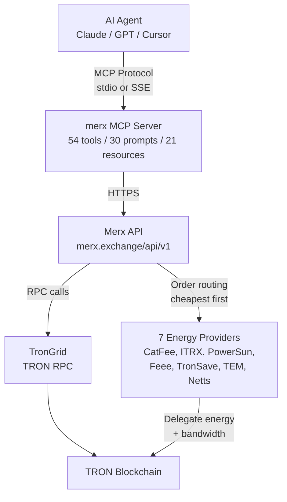
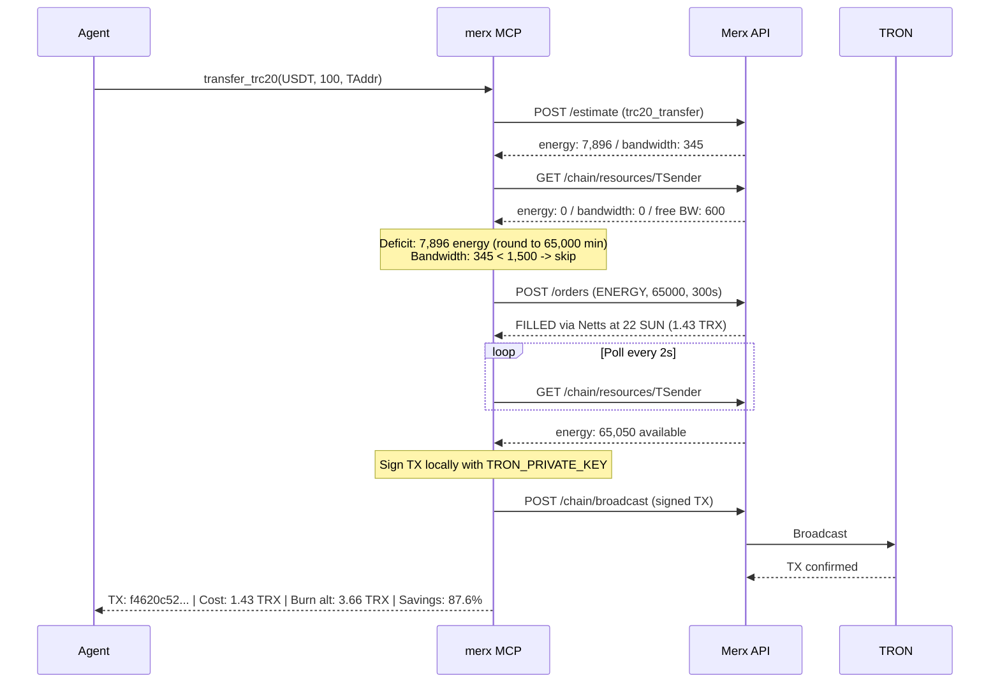
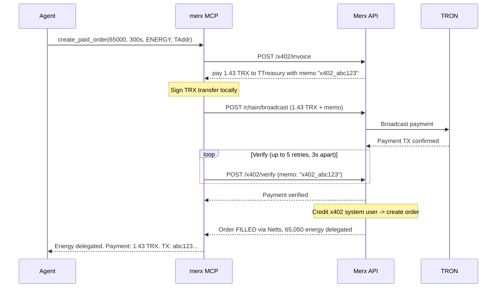

# Architecture

This document describes the internal architecture of the merx MCP server: how
requests flow, how resources are managed, and how the major subsystems interact.

---

## High-level overview



<details>
<summary>ASCII diagram (if Mermaid does not render)</summary>

```
AI Agent (Claude / GPT / Cursor)
    |
    | MCP Protocol (stdio or SSE)
    v
merx MCP Server (54 tools)
    |
    | HTTPS
    v
Merx API (merx.exchange/api/v1)
    |
    +---> TronGrid (TRON RPC)
    |         |
    |         v
    |     TRON Blockchain
    |
    +---> 7 Energy Providers
              |
              v
          TRON Blockchain (delegate energy + bandwidth)
```

</details>

### Key principle

All traffic goes through the Merx API. The user never needs TronGrid API keys.
Merx manages all RPC infrastructure, caching, and failover server-side. The only
operation that stays on the client is transaction signing with `TRON_PRIVATE_KEY`.
Private keys never leave the MCP process.

---

## Request flow

Every tool call follows the same pattern:

1. Agent sends a natural language request to the AI model.
2. The model selects the appropriate merx tool and constructs parameters.
3. The MCP server validates inputs, checks authentication tier, and calls the Merx API.
4. The Merx API executes the operation (on-chain query, provider order, broadcast).
5. Results return through the same chain to the agent.

For read-only tools (prices, estimation, on-chain queries), this is the complete
flow. For write tools (transfers, swaps, contract calls), the resource-aware
transaction flow described below kicks in.

---

## Resource-aware transaction flow

Every write operation automatically estimates, acquires, and verifies resources
before broadcasting. This is the core differentiator of merx.

### Detailed steps

1. **Estimate resources.** The MCP server calls `POST /api/v1/estimate` with the
   transaction type and parameters. The API returns the exact energy and bandwidth
   required. For simple transfers (TRX, TRC20), estimates are based on known
   consumption. For DEX swaps and arbitrary contract calls, exact simulation is used
   (see next section).

2. **Check existing resources.** The server calls `GET /api/v1/chain/resources/{address}`
   to check what the sender address already has: staked energy, staked bandwidth,
   delegated energy, delegated bandwidth, and free daily bandwidth (1,500 for all
   addresses).

3. **Calculate deficit.** Subtract available resources from required resources.
   Apply purchase rules:
   - If energy deficit > 0: round up to the provider minimum of 65,000 units. Even
     small deficits are cheaper to cover with a minimum order than to burn TRX.
   - If bandwidth deficit > 0 but < 1,500: skip the purchase entirely. Burning
     bandwidth costs approximately 0.3 TRX, which is less than a minimum bandwidth
     order. The 1,500 free daily bandwidth often covers simple transactions.
   - If bandwidth deficit >= 1,500: purchase bandwidth at market price.

4. **Buy deficit at best price.** The server calls `POST /api/v1/orders` with the
   required resource type, amount, and a short duration (typically 300 seconds / 5
   minutes for one-time transactions). The API routes the order to the cheapest
   available provider. If the cheapest provider fails, the next cheapest fills it.

5. **Wait for delegation.** After the order is filled, the server polls
   `GET /api/v1/chain/resources/{address}` every 2 seconds until the delegated
   resources appear on-chain. This typically takes 3-6 seconds. The server will
   not proceed until delegation is confirmed.

6. **Sign locally.** The transaction is constructed and signed using the
   `TRON_PRIVATE_KEY` inside the MCP process. The private key is never sent to
   the Merx API or any external service.

7. **Broadcast.** The signed transaction is sent via `POST /api/v1/chain/broadcast`.
   The API relays it to TronGrid for inclusion in the next block.

8. **Return results.** The server returns the transaction hash, resource costs,
   and savings compared to burning.

### Sequence diagram



<details>
<summary>ASCII diagram (if Mermaid does not render)</summary>

```
Agent                   merx MCP                Merx API                TRON
  |                       |                       |                      |
  | transfer_trc20(...)   |                       |                      |
  |---------------------->|                       |                      |
  |                       | POST /estimate        |                      |
  |                       |---------------------->|                      |
  |                       |   energy: 7,896       |                      |
  |                       |   bandwidth: 345      |                      |
  |                       |<----------------------|                      |
  |                       | GET /chain/resources  |                      |
  |                       |---------------------->|                      |
  |                       |   energy: 0, BW: 0    |                      |
  |                       |<----------------------|                      |
  |                       |                       |                      |
  |                       | [Deficit: 7,896 -> 65,000 min order]        |
  |                       | [Bandwidth: 345 < 1,500 -> skip]            |
  |                       |                       |                      |
  |                       | POST /orders          |                      |
  |                       | (ENERGY, 65000, 300s) |                      |
  |                       |---------------------->|                      |
  |                       |   FILLED via Netts    |                      |
  |                       |   22 SUN = 1.43 TRX   |                      |
  |                       |<----------------------|                      |
  |                       |                       |                      |
  |                       | [Poll every 2s until delegation arrives]     |
  |                       |                       |                      |
  |                       | GET /chain/resources  |                      |
  |                       |---------------------->|                      |
  |                       |   energy: 65,050      |                      |
  |                       |<----------------------|                      |
  |                       |                       |                      |
  |                       | [Sign TX locally]     |                      |
  |                       |                       |                      |
  |                       | POST /chain/broadcast |                      |
  |                       |---------------------->|--------------------->|
  |                       |                       |   TX confirmed       |
  |   TX sent             |<----------------------|<---------------------|
  |   Cost: 1.43 TRX      |                       |                      |
  |   Savings: 87.6%      |                       |                      |
  |<----------------------|                       |                      |
```

</details>

---

## Exact energy simulation for DEX swaps

For token swaps and arbitrary contract calls, hardcoded energy estimates are
unreliable. Swap energy consumption varies with pool depth, token pair, slippage,
and routing path. merx uses exact simulation.

### How it works

1. The MCP server constructs the full transaction parameters: contract address,
   function selector, ABI-encoded arguments, call value, and fee limit.

2. These parameters are sent to `triggerConstantContract` on TronGrid via the
   Merx API. This executes the transaction against the current chain state without
   broadcasting it.

3. The simulation returns the exact energy consumption. For a SunSwap V2 swap of
   0.1 TRX to USDT, the simulation returned 223,354 energy. The subsequent on-chain
   transaction consumed exactly 223,354 energy.

4. The resource-aware flow then uses this exact figure instead of a heuristic
   estimate, ensuring no over-purchase and no under-purchase.

### When simulation is used

| Transaction type | Estimation method |
|---|---|
| TRX transfer | Fixed: 0 energy, 268 bandwidth |
| TRC20 transfer (existing holder) | Fixed: ~7,900 energy, ~345 bandwidth |
| TRC20 transfer (new holder) | Fixed: ~13,000 energy, ~345 bandwidth |
| TRC20 approval | Fixed: ~7,500 energy, ~345 bandwidth |
| DEX swap (SunSwap V2) | Exact simulation via triggerConstantContract |
| Arbitrary contract call | Exact simulation via triggerConstantContract |

---

## x402 pay-per-use flow

x402 enables zero-registration energy purchases. No Merx account, no pre-deposit,
no dashboard. The agent pays directly from its wallet and receives energy delegation.

### Steps

1. **Create invoice.** The agent calls `create_paid_order` with the desired energy
   amount, duration, and target address. The MCP server requests an invoice from
   the Merx API.

2. **API returns invoice.** The invoice contains: payment address (Merx treasury),
   exact TRX amount, and a unique memo string for identification.

3. **Pay invoice.** The MCP server signs and broadcasts a TRX transfer to the
   payment address with the memo. This uses the agent's `TRON_PRIVATE_KEY`.

4. **Verify payment.** The MCP server calls the verification endpoint up to 5 times
   with 3-second intervals between attempts (15 seconds total window). The API
   checks the TRON blockchain for the payment transaction matching the memo.

5. **Credit and fulfill.** Once verified, the API credits the x402 system user
   internally, creates an energy order against that balance, and routes it to the
   cheapest provider.

6. **Delegation arrives.** The target address receives the energy delegation. The
   MCP server returns the order details, payment TX hash, and delegation TX hash.

### Sequence diagram



<details>
<summary>ASCII diagram (if Mermaid does not render)</summary>

```
Agent                   merx MCP                Merx API                TRON
  |                       |                       |                      |
  | create_paid_order()   |                       |                      |
  |---------------------->|                       |                      |
  |                       | POST /x402/invoice    |                      |
  |                       |---------------------->|                      |
  |                       |   pay 1.43 TRX        |                      |
  |                       |   memo: x402_abc123   |                      |
  |                       |<----------------------|                      |
  |                       |                       |                      |
  |                       | [Sign TRX transfer locally]                  |
  |                       |                       |                      |
  |                       | POST /chain/broadcast |                      |
  |                       |---------------------->|--------------------->|
  |                       |                       |   Payment confirmed  |
  |                       |<----------------------|<---------------------|
  |                       |                       |                      |
  |                       | POST /x402/verify     |                      |
  |                       | (retry up to 5x, 3s)  |                      |
  |                       |---------------------->|                      |
  |                       |   Payment verified    |                      |
  |                       |<----------------------|                      |
  |                       |                       |                      |
  |                       |   [API credits x402 user, creates order]     |
  |                       |                       |                      |
  |                       |   Order FILLED        |                      |
  |                       |   65,050 energy        |                      |
  |   Energy delegated    |<----------------------|                      |
  |   Payment: 1.43 TRX   |                       |                      |
  |<----------------------|                       |                      |
```

</details>

---

## Standing orders

Standing orders are server-side automation rules stored in PostgreSQL. They persist
across MCP session restarts and execute when the agent is offline.

### Trigger types

| Trigger | Description | Example |
|---|---|---|
| `price_below` | Execute when energy price drops below threshold | Buy 65,000 energy when price < 20 SUN |
| `price_above` | Execute when energy price rises above threshold | Alert when price > 60 SUN |
| `schedule` | Execute on a cron schedule | Buy 100,000 energy every day at 03:00 UTC |
| `balance_below` | Execute when account balance drops below threshold | Top up energy when balance < 10 TRX |

### Polling intervals

The Merx API polls standing order conditions at the following intervals:

- Price triggers (`price_below`, `price_above`): every 30 seconds, aligned with
  provider price refresh cycles.
- Schedule triggers: evaluated every 60 seconds against cron expression.
- Balance triggers: every 60 seconds.

### Lifecycle

1. Agent creates a standing order via `create_standing_order`.
2. The order is stored in PostgreSQL with status `active`.
3. The API evaluates trigger conditions on each polling cycle.
4. When triggered, the API creates a regular energy/bandwidth order.
5. The standing order records the execution timestamp and can be configured for
   one-shot (deactivate after first trigger) or recurring execution.
6. Agent can list, pause, or cancel standing orders via `list_standing_orders`.

---

## Intent engine

The intent engine handles multi-step operation plans. An agent describes a sequence
of actions (e.g., "transfer USDT to address A, then swap TRX to USDT, then transfer
USDT to address B"), and merx simulates and executes the entire plan.

### Resource strategies

| Strategy | Description |
|---|---|
| `batch_cheapest` | Estimate total resources across all steps, buy once at the cheapest rate. More efficient when steps share the same sender address. |
| `per_step` | Buy resources separately for each step. Required when steps use different sender addresses or when energy consumption depends on prior steps. |

### Stateful simulation

The `simulate` tool runs all steps in sequence against current chain state. Energy
consumed by step N is subtracted from available resources for step N+1. This
prevents over-estimation when a single energy purchase covers multiple steps and
prevents under-estimation when it does not.

### Execution

The `execute_intent` tool runs the plan for real. Each step follows the full
resource-aware transaction flow: estimate, check, buy deficit, wait for delegation,
sign, broadcast. If any step fails, execution stops and returns partial results
with the failure reason.

---

## Session management

The MCP server supports two authentication methods:

### Environment variables (stdio transport)

Set `MERX_API_KEY` and `TRON_PRIVATE_KEY` in the MCP client configuration. Keys
are available from the first message. Recommended for local installations where
the config file is secured.

### Session-based auth (SSE transport)

For hosted SSE connections (e.g., Claude.ai), keys cannot be set via environment
variables. Instead, the agent calls:

- `set_api_key("merx_sk_...")` -- unlocks authenticated tools for the current session.
- `set_private_key("64_char_hex...")` -- unlocks write tools for the current session.
  The address is derived automatically and displayed to the agent.

Session keys are held in memory only. They are never persisted, never logged, and
never sent to external services. When the MCP session ends, keys are discarded.

### Graceful degradation

The server operates at three tiers based on available credentials:

| Tier | Credentials | Tools available |
|---|---|---|
| Anonymous | None | 22 read-only tools: prices, estimation, market analysis, on-chain queries |
| Authenticated | API key | 40 tools: + orders, balance, standing orders, monitors, account management |
| Full access | API key + private key | 54 tools: + transfers, swaps, approvals, contract execution, intents, x402 |

This design allows agents to start with zero configuration and progressively unlock
capabilities as needed.
