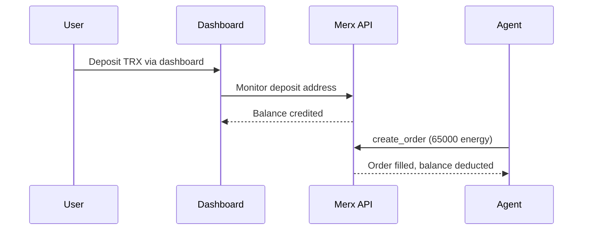
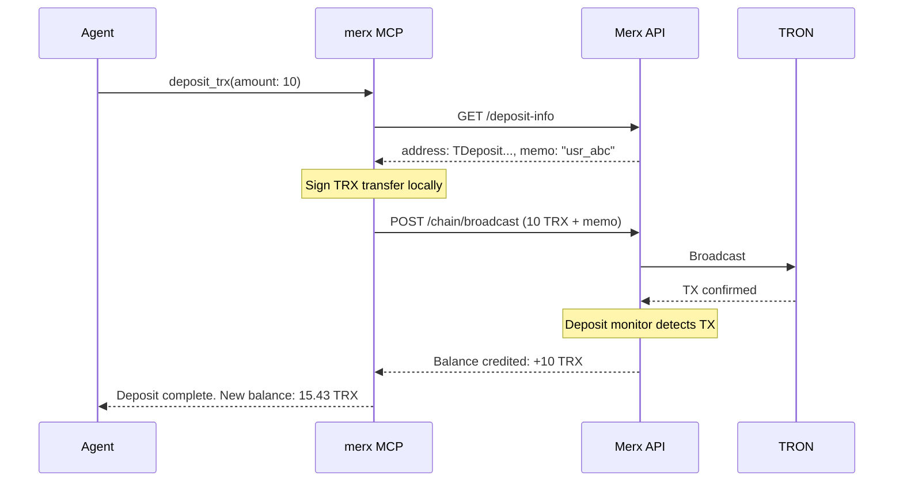
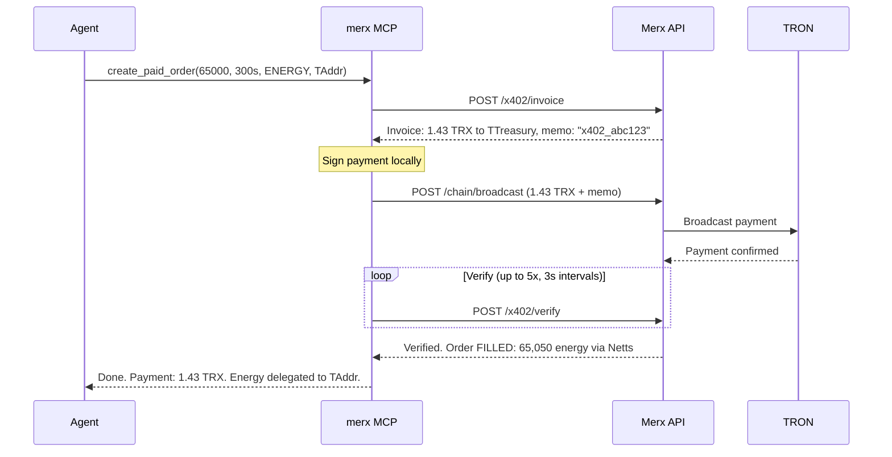

# Payment methods

merx supports three payment methods for energy and bandwidth purchases. Each method
suits different use cases: pre-funded accounts for high-volume operations,
self-deposit for wallet-based agents, and x402 for zero-registration one-off
purchases.

---

## Method 1: Pre-funded Merx balance

Deposit TRX to your Merx account via the dashboard at merx.exchange. Orders are
deducted from your account balance.

### How it works

1. Log in at merx.exchange.
2. Navigate to Deposit.
3. Send TRX to the displayed deposit address.
4. Balance is credited after on-chain confirmation (typically 1-2 minutes).
5. Use `create_order` to buy energy. Cost is deducted from your Merx balance.

### Flow diagram



<details>
<summary>ASCII diagram (if Mermaid does not render)</summary>

```
User              Dashboard         Merx API           Agent
  |                  |                 |                  |
  | Deposit TRX      |                 |                  |
  |----------------->|                 |                  |
  |                  | Monitor deposit |                  |
  |                  |---------------->|                  |
  |                  | Balance credited|                  |
  |                  |<----------------|                  |
  |                  |                 |                  |
  |                  |                 | create_order     |
  |                  |                 |<-----------------|
  |                  |                 | Order filled     |
  |                  |                 |----------------->|
```

</details>

### When to use

- High-volume operations (multiple orders per day).
- Teams sharing a single Merx account across multiple agents.
- When you want to track spending via the dashboard.

---

## Method 2: Self-deposit from wallet

The agent deposits TRX from its own wallet directly to the Merx account, without
visiting the dashboard. Uses the `deposit_trx` tool.

### How it works

1. Agent calls `get_deposit_info` to retrieve the deposit address and memo.
2. Agent calls `deposit_trx` with the desired amount. The tool signs and broadcasts
   a TRX transfer to the deposit address with the account memo.
3. The Merx API detects the deposit on-chain and credits the balance.
4. Balance is available for orders within 1-2 minutes.

### Flow diagram



<details>
<summary>ASCII diagram (if Mermaid does not render)</summary>

```
Agent                   merx MCP                Merx API                TRON
  |                       |                       |                      |
  | deposit_trx(10)       |                       |                      |
  |---------------------->|                       |                      |
  |                       | GET /deposit-info     |                      |
  |                       |---------------------->|                      |
  |                       |   addr: TDeposit      |                      |
  |                       |   memo: usr_abc       |                      |
  |                       |<----------------------|                      |
  |                       |                       |                      |
  |                       | [Sign transfer locally]                      |
  |                       |                       |                      |
  |                       | POST /chain/broadcast |                      |
  |                       |---------------------->|--------------------->|
  |                       |                       |   TX confirmed       |
  |                       |<----------------------|<---------------------|
  |                       |                       |                      |
  |                       |   [Deposit monitor detects TX]               |
  |                       |   Balance: +10 TRX    |                      |
  |   Deposit complete    |<----------------------|                      |
  |   Balance: 15.43 TRX  |                       |                      |
  |<----------------------|                       |                      |
```

</details>

### When to use

- Automated top-ups without human intervention.
- Agents managing their own TRX wallet.
- Combine with `enable_auto_deposit` to automatically top up when balance drops
  below a threshold.

### Auto-deposit

The `enable_auto_deposit` tool configures automatic balance replenishment:

```
Agent: enable_auto_deposit(threshold: 5, amount: 20)
-> When balance drops below 5 TRX, automatically deposit 20 TRX from wallet.
```

This runs server-side and works even when the agent is offline.

---

## Method 3: x402 pay-per-use

No Merx account required. No registration, no dashboard, no pre-deposit. The agent
pays for each order directly from its wallet at the time of purchase.

### How it works

1. Agent calls `create_paid_order` with the energy amount, duration, resource type,
   and target address.
2. The MCP server requests an invoice from the Merx API. The invoice specifies: the
   treasury payment address, the exact TRX amount, and a unique memo for
   identification.
3. The MCP server signs a TRX transfer to the treasury address with the memo and
   broadcasts it.
4. The MCP server polls the verification endpoint up to 5 times, 3 seconds apart.
   The API checks the blockchain for the payment transaction matching the memo.
5. Once verified, the API credits an internal x402 system user, creates an energy
   order, and routes it to the cheapest provider.
6. The target address receives the energy delegation.

### Flow diagram



<details>
<summary>ASCII diagram (if Mermaid does not render)</summary>

```
Agent                   merx MCP                Merx API                TRON
  |                       |                       |                      |
  | create_paid_order()   |                       |                      |
  |---------------------->|                       |                      |
  |                       | POST /x402/invoice    |                      |
  |                       |---------------------->|                      |
  |                       |   1.43 TRX, memo      |                      |
  |                       |<----------------------|                      |
  |                       |                       |                      |
  |                       | [Sign payment locally]                       |
  |                       |                       |                      |
  |                       | POST /chain/broadcast |                      |
  |                       |---------------------->|--------------------->|
  |                       |                       |   Payment confirmed  |
  |                       |<----------------------|<---------------------|
  |                       |                       |                      |
  |                       | POST /x402/verify     |                      |
  |                       | (up to 5x, 3s apart)  |                      |
  |                       |---------------------->|                      |
  |                       |   Verified            |                      |
  |                       |<----------------------|                      |
  |                       |                       |                      |
  |   Energy delegated    |   Order FILLED        |                      |
  |   Payment: 1.43 TRX   |   65,050 via Netts    |                      |
  |<----------------------|<----------------------|                      |
```

</details>

### When to use

- One-off energy purchases without creating an account.
- Agents that manage their own wallet and prefer pay-as-you-go.
- Testing merx before committing to an account.
- Automated pipelines where account management adds unnecessary complexity.

### Production example

Tested on TRON mainnet (2026-03-30):

```
create_paid_order(65000, 300, "ENERGY", "THT49...")
-> Invoice: 1.43 TRX to TTreasury with memo "x402_ed7efe5f"
-> Payment TX broadcast: a1b2c3d4...
-> Verification: success on attempt 2 (6 seconds)
-> Order filled: 65,050 energy via Netts at 22 SUN
-> Delegation TX: 27ab0019...
```

---

## Comparison

| | Pre-funded | Self-deposit | x402 |
|---|---|---|---|
| Account required | Yes | Yes | No |
| Dashboard needed | Yes (for deposit) | No | No |
| Private key needed | No | Yes | Yes |
| Minimum setup | Create account, deposit | Create account, set private key | Set private key only |
| Balance tracking | Via dashboard + `get_balance` | Via dashboard + `get_balance` | Per-transaction |
| Auto top-up | Manual via dashboard | `enable_auto_deposit` | N/A |
| Best for | Teams, high volume | Single agent, automated | One-off, testing, no-account |

---

## Security

Regardless of payment method, the following security properties hold:

- **Private keys never leave the MCP process.** Transaction signing happens locally.
  Keys are never sent to the Merx API.
- **Keys are held in memory only.** For SSE sessions, keys set via `set_private_key`
  are discarded when the session ends. For stdio, keys are read from environment
  variables and exist only in the process memory.
- **No key logging.** Private keys are never written to logs, error messages, or
  telemetry.
